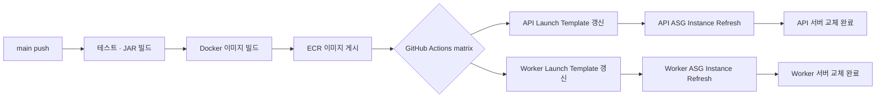

# DROPIT Server


> 정해진 시간, 한정된 수량으로 만나는 드랍 커머스

## 프로젝트 소개

**DROPIT은 크리에이터(유튜버, 인플루언서, 스트리머 등)가 자신의 팬을 대상으로 한정판매 굿즈를 특정 날짜와 시간에 공개하고 판매할 수 있는 드랍 커머스 서비스입니다.**

일반 커머스가 상품을 언제든지 탐색하고 구매할 수 있다면,
DROPIT은 정해진 시간에 판매가 시작되고 팬들이 동시에 구매를 시도하는 Drop 이벤트를 핵심 경험으로 합니다.

- 판매자는 상품(Product)을 등록한 뒤 판매 기간, 가격, 재고, 1인당 구매 한도를 설정해 드랍(Drop)을 엽니다. 같은 상품으로 여러 번의 드랍을 열 수 있어 상품 정보와 개별 판매를 분리해 관리합니다.
- 구매자에게는 상품을 발견하는 것부터 판매 시간을 챙기고 구매하는 것까지 이어지는 경험을 제공하고자 합니다. 관심 있는 드랍을 판매 시작 전부터 미리 탐색해서 찜해두고, 판매 시작 10분 전이나 품절 임박 등의 상황에 알림을 받을 수 있습니다.

## 프로젝트 목표

**동시성 상황에서도 재고와 구매 한도의 정합성을 지키고, 캐시와 비동기 알림으로 빠른 구매 경험을 제공하는 것을 목표로 합니다.**

단순히 상품을 등록하고 주문을 받는 것 외에도 해결해야 될 문제 포인트로 크게 네 가지에 집중했습니다.

1. 주문이 한꺼번에 몰려도 재고를 초과해서 판매하지 않는다.
   - 굿즈가 1,000개라면, 동시에 수많은 요청이 들어와도 확정된 주문 수량은 1,000개를 넘으면 안 됩니다. 마지막 재고를 여러 사람이 동시에 구매하거나, 같은 요청이 다시 들어오는 상황에서도 재고가 정확하게 반영되어야 합니다.
2. 개인별 구매 한도를 지킨다.
   - 한 번에 3개까지만 주문하도록 제한하는 것으로는 충분하지 않고, 같은 사용자가 2개씩 여러 번 주문하거나, 여러 창에서 동시에 요청하는 상황에도 대비합니다.
3. 조회가 몰려도 상품을 빠르게 확인할 수 있다.
   - 판매 시작 전부터 트래픽이 몰리기 시작하면 목록 조회나 상세 정보 조회 등의 요청이 집중될 수 있습니다. 반복적인 DB 조회 부담을 줄입니다.
4. 유저가 판매 시간을 놓치지 않게 돕는다.
   - 짧은 시간에 매진되는 판매에서는 시작 시간을 놓치는 것이 구매 기회를 놓치는 것으로 이어질 수 있습니다.

## 팀 구성

| 팀원                                                     | 포지션                   | 주요 담당과 기여                                                                                                                                                                                                   |
| -------------------------------------------------------- | ------------------------ | ------------------------------------------------------------------------------------------------------------------------------------------------------------------------------------------------------------------ |
| 구스타보 ([gustavors88](https://github.com/gustavors88)) | Backend                  | 회원 CRUD·탈퇴, Spring Security/JWT, 회원가입·로그인·재발급·로그아웃, S3 상품/프로필 이미지 업로드·삭제·CloudFront URL/캐시 정책, Lambda 상품 이미지 리사이징/WebP 변환                                            |
| 윤수영 ([ddooyn](https://github.com/ddooyn))             | Backend · Infrastructure | 드랍 CRUD/판매 정책, 주문·구매 한도·Redis Lua·SQS Worker·멱등/취소 복구, REST Docs/OpenAPI, AWS/CI/CD·API/Worker ASG 분리, EventBridge Scheduler + ECS Fargate 판매자 랭킹 배치                                    |
| 이준구 ([jungu8745](https://github.com/jungu8745))       | Backend                  | SellerProfile CRUD·판매자 권한, Wishlist CRUD, Notification 저장/조회/읽음, 찜 상품 판매 임박 Scheduler 및 SQS 알림 연동                                                                                           |
| 전현재 ([Hyiyek](https://github.com/Hyiyek))             | Backend · Performance    | 상품 CRUD·판매자별 상품/드랍 조회, QueryDSL 검색/정렬, 상품 삭제-드랍 생성 경합 제어, fetch join·상세/목록 Redis 캐시·L1 및 장애 대체 조회, NGINX/다중 서버/k6/Grafana 성능 검증, 구매 성공 이메일 Outbox/SQS 발행 |

## 기술 스택

### Application

| 구분                | 사용 기술                                       |
| ------------------- | ----------------------------------------------- |
| Language            | Java 21                                         |
| Framework           | Spring Boot 4.1.1, Spring MVC, Spring Security  |
| Persistence         | Spring Data JPA, QueryDSL, MySQL 8.4            |
| Cache / Concurrency | Redis 7.4, ElastiCache Valkey, Redis Lua Script |
| Messaging           | Spring Cloud AWS SQS, Transactional Outbox      |
| Authentication      | JWT (`jjwt`)                                    |
| Build               | Gradle                                          |
| Test                | JUnit, Mockito, Testcontainers                  |
| API Docs            | Spring REST Docs → OpenAPI → Swagger UI         |

### Infrastructure & AWS

| 구분               | 사용 기술 / 서비스                                    |
| ------------------ | ----------------------------------------------------- |
| Compute            | EC2, Auto Scaling Group, Launch Template, ECS Fargate |
| Network            | VPC, ALB                                              |
| Database           | RDS MySQL                                             |
| Cache              | ElastiCache Valkey                                    |
| Messaging          | SQS                                                   |
| Storage / CDN      | S3, CloudFront                                        |
| Image Processing   | Lambda                                                |
| Container Registry | ECR                                                   |
| Batch              | EventBridge Scheduler, ECS Fargate                    |
| Configuration      | Systems Manager Parameter Store                       |
| CI/CD              | GitHub Actions, OIDC                                  |
| Container          | Docker, Docker Compose                                |

### Performance & Observability

| 구분                   | 사용 기술                     |
| ---------------------- | ----------------------------- |
| Load Test              | k6                            |
| Local Distributed Test | NGINX                         |
| Metrics / Monitoring   | Prometheus, Grafana, InfluxDB |

## 시스템 아키텍처


| 실행 역할    | 하는 일                              | 확장/실행 기준           |
| ------------ | ------------------------------------ | ------------------------ |
| API ASG      | 인증·CRUD·조회·주문 접수/조회/취소   | HTTP 트래픽              |
| Worker ASG   | SQS 주문 확정·예약 상태 동기화       | 주문 큐와 DB 처리 여유   |
| Ranking Task | 판매 수량 전체/월간 집계·스냅샷 발행 | 매시간 단발 실행 후 종료 |
| Lambda       | S3 업로드 이미지 리사이징            | 이미지 업로드 이벤트     |

## 주요 기능

### 서비스 전체 흐름도


<details>
<summary><strong>주문 접수 흐름</strong></summary>

</details>

<details>
<summary><strong>주문 확정 흐름</strong></summary>

</details>

<details>
<summary><strong>주문 이후 흐름 - 구매 완료 메일 발송</strong></summary>


</details>

<details>
<summary><strong>주문 이후 흐름 - 매시간 판매자 랭킹 집계</strong></summary>

</details>

### 주요 경험

| 흐름      | 주제                         | 구현 내용                                                                                                                                               | 핵심 효과                                                                        |
| --------- | ---------------------------- | ------------------------------------------------------------------------------------------------------------------------------------------------------- | -------------------------------------------------------------------------------- |
| 판매 준비 | 한정 판매 상태 관리          | 판매 시각과 잔여 재고를 기준으로 `READY`, `OPEN`, `SOLDOUT`, `CLOSED` 상태를 계산합니다. 판매 정보 수정·삭제는 판매 시작 전으로 제한합니다.             | 판매 조건을 일관되게 관리하고 판매 중 데이터 변경을 방지합니다.                  |
| 판매 준비 | 상품 이미지 처리             | S3에 UUID Key로 원본을 저장하고, CloudFront URL로 제공합니다. S3 이벤트는 Lambda 이미지 리사이징으로 연결합니다.                                        | 파일명 충돌을 막고 API 요청과 이미지 가공 부하를 분리합니다.                     |
| 탐색      | 캐시와 실시간 재고 분리      | 드랍 목록·상세의 정적 정보는 캐시하고, 잔여 재고와 판매 상태는 별도 경로에서 계산합니다.                                                                | 오래된 캐시가 실제 판매 가능 상태를 가리지 않도록 합니다.                        |
| 탐색      | 찜과 판매 임박 알림          | 판매 임박 드랍의 찜 사용자를 조회한 뒤 SQS를 통해 Notification을 저장합니다.                                                                            | 알림 생성과 저장 처리를 비동기로 분리합니다.                                     |
| 주문      | 비동기 주문 접수와 최종 확정 | Redis Lua로 재고·구매 한도를 원자적으로 검증한 뒤 `requestId`와 함께 SQS에 전달합니다. Worker가 멱등성을 확인하고 MySQL 트랜잭션으로 주문을 확정합니다. | API 접수와 DB 확정의 책임을 분리하고, 중복 메시지에도 주문을 한 번만 확정합니다. |
| 주문      | 주문 시점 정보 보존          | `OrderItem`에 상품명·정가·할인율·수량·최종 금액을 저장합니다.                                                                                           | 이후 상품 정보가 변경되어도 과거 주문을 재현할 수 있습니다.                      |
| 주문 이후 | 주문 취소와 상태 복구        | 취소 시 재고와 사용자별 구매 수량을 복원하고, Redis 동기화 실패는 재시도 대상으로 기록합니다.                                                           | 취소 이후에도 재고·구매 한도와 주문 상태를 복구할 수 있습니다.                   |
| 주문 이후 | 구매 완료 이메일             | 주문 성공 트랜잭션에서 Outbox 이벤트를 기록하고, Relay가 이메일 SQS로 발행합니다.                                                                       | 주문 확정과 이메일 이벤트 발행의 정합성을 높입니다.                              |
| 주문 이후 | 판매자 랭킹 배치             | EventBridge Scheduler가 Fargate 단발 Task를 실행하고, MySQL 판매 수량을 집계해 Redis Sorted Set 스냅샷을 발행합니다.                                    | 집계 작업과 랭킹 조회를 분리하고 전체·월간 순위를 제공합니다.                    |
| 공통 기반 | JWT 기반 API 보안            | JWT 인증과 `@CurrentUserId` 기반 소유권 검증을 적용합니다.                                                                                              | 인증된 사용자만 자신의 리소스에 접근할 수 있습니다.                              |
| 공통 기반 | 역할별 AWS 배포              | 하나의 Docker 이미지를 API ASG와 Worker ASG에 각각 배포하고, `AWS_SQS_CONSUMER_ENABLED`를 API=`false`, Worker=`true`로 주입합니다.                      | HTTP 처리와 SQS 소비·백그라운드 작업을 역할별로 분리합니다.                      |
| 공통 기반 | API 문서 자동화              | REST Docs 테스트 결과로 OpenAPI 명세를 생성하고 Swagger UI에서 제공합니다.                                                                              | 구현과 API 계약의 차이를 테스트로 줄입니다.                                      |
| 공통 기반 | AWS 접근 권한 관리           | IAM User Group을 만들고 팀원별 IAM 사용자를 그룹에 연결해, 그룹 정책으로 팀의 AWS 접근 권한을 관리합니다.                                               | 팀원별 권한을 일관되게 관리하고, 필요한 AWS 리소스에만 접근하도록 제어합니다.    |

## ERD

> [ERD Docs 바로가기](https://dbdocs.io/ayoooo240/dropit?view=relationships)


## API 문서

Spring REST Docs를 사용하고, 테스트 스니펫을 OpenAPI 3.0.1 명세로 변환합니다.
Swagger UI는 이 명세 파일을 읽어 화면에 보여주는 역할만 하므로, 별도의 어노테이션 기반 API 명세가 생기지 않습니다.

`bootRun`과 `bootJar`는 테스트와 OpenAPI 생성 작업을 먼저 실행한 뒤 생성된 YAML을 애플리케이션 정적 리소스에 포함합니다.
명세와 Swagger UI 리소스를 단독으로 준비하려면 `./gradlew openApiDocs`를 실행합니다.
명세만 생성하려면 `./gradlew openapi3`를 실행하며, 결과는 `build/api-spec/openapi3.yaml`에 저장됩니다. (생성물은 빌드 디렉터리에만 남으며 저장소에는 커밋하지 않습니다.)

브라우저에서 http://localhost:8080/swagger-ui/index.html를 열면 API 문서를 확인할 수 있습니다.
원본 명세는 http://localhost:8080/openapi/openapi3.yaml 경로에서도 직접 확인할 수 있습니다.

Swagger UI와 OpenAPI YAML은 HTTP Basic Auth로 보호됩니다.
로컬에서는 `.env.local`에 다음 두 값을 설정합니다.

```properties
DOCS_AUTH_USERNAME=<local username>
DOCS_AUTH_PASSWORD=<local password>
```

인증이 필요한 API는 다음 헤더를 전달합니다.

```http
Authorization: Bearer {accessToken}
```

## 기술적 의사결정

<details>

<summary><strong>01. Redis Lua + MySQL 조건부 갱신으로 재고와 구매 한도 제어</strong></summary>

- 구현한 기능
  - 판매 시간·예약 재고·사용자 누적 구매량을 Lua Script 한 번으로 검증하고, 최종 DB 트랜잭션에서 구매 한도와 재고를 다시 확인합니다.
- 전체 로직
  - 접수 Lua → 사용자·드랍 카운터 증가 → 재고 조건부 UPDATE → 주문 저장
  - DB 변경은 하나의 트랜잭션으로 처리합니다.
- 배경
  - 애플리케이션에서 재고를 조회한 뒤 별도로 차감하면, 여러 요청이 동시에 같은 재고를 조회해 초과 판매가 발생할 수 있습니다.
- 요구사항
  - 재고가 음수가 되지 않아야 합니다.
  - 사용자별 누적 구매 한도를 보장해야 합니다.
  - 처리 도중 실패하더라도 일부 데이터만 변경되어서는 안 됩니다.
  - 여러 API 인스턴스에서도 동일한 재고·구매 제한 규칙이 적용되어야 합니다.
- 선택지
  - 애플리케이션의 `synchronized`는 여러 서버 간에 공유되지 않아 분산 환경에서는 사용할 수 없습니다.
  - DB 비관적 잠금만 사용하면 데이터 정합성은 보장할 수 있지만, 주문 요청이 몰릴 경우 많은 요청이 DB 잠금을 기다리게 됩니다.
  - Redis만 최종 데이터로 사용하면 주문 DB와 값이 달라졌을 때 복구하기 어렵습니다.
- 의사결정 및 사유
  - Redis는 주문 요청 단계에서 재고와 구매 한도를 빠르게 확인하고 예약하는 역할을 담당합니다.
  - 실제 주문과 재고의 최종 상태는 MySQL을 기준으로 판단합니다.
  - 재고 차감은 조건부 UPDATE로 처리하고, 변경된 행이 1개인지 확인해 재고 및 구매 조건 충족 여부를 최종 검증합니다.
- 검증 결과
  - `RedisOrderFlowIntegrationTest`와 `OrderAdmissionServiceTest`를 통해 동시 예약, 재고 부족, 구매 한도 초과, 동일 요청 재시도를 검증했습니다.
- 관련 파일
  - [OrderFinalizationService.java](/src/main/java/com/dropit/order/service/OrderFinalizationService.java)

</details>

---

<details>

<summary><strong>02. SQS 비동기 주문과 requestId 멱등 처리</strong></summary>

- 구현한 기능
  - 주문 요청 접수와 실제 주문 확정을 분리하고, HTTP 요청 재전송이나 SQS 중복 메시지가 발생해도 동일한 주문 결과를 반환하도록 처리했습니다.
- 전체 로직
  - Idempotency-Key 해시 → 예약 snapshot → SQS → OrderRequest 등록/기존 요청 비교 → 이미 처리가 끝난 요청이면 추가 처리 생략 → Redis 동기화 → manual ACK
- 배경
  - HTTP 응답이나 SQS 처리 결과가 유실되면 요청을 보낸 쪽에서는 성공 여부를 알 수 없어 같은 요청을 다시 보낼 수 있습니다.
- 요구사항
  - 동일한 요청으로 주문이 중복 생성되지 않아야 합니다.
  - 같은 Idempotency-Key를 다른 주문 내용에 재사용하면 충돌로 처리해야 합니다.
  - DB 처리가 완료되기 전에 SQS 메시지가 ACK되어서는 안 됩니다.
- 선택지
  - 동기 HTTP 방식은 구조가 단순하지만 DB 처리 지연이 사용자 요청에 그대로 영향을 줍니다.
  - 애플리케이션 메모리 큐는 서버 재시작 시 메시지가 유실될 수 있습니다.
  - SQS는 메시지를 보관하고 Producer와 Consumer를 분리할 수 있지만, 같은 메시지가 여러 번 전달될 가능성을 고려해야 합니다.
- 의사결정 및 사유
  - 요청 식별자와 요청 내용을 식별할 수 있는 fingerprint를 DB에 저장합니다.
  - 이미 처리된 요청은 저장된 상태를 확인해 다시 주문을 생성하지 않습니다.
  - 주문 처리와 Redis 동기화가 정상적으로 끝난 뒤에만 Listener가 메시지를 ACK하도록 구성했습니다.
- 검증 결과
  - `OrderMessageProcessor`, `SqsOrderMessageListener`, `OrderRequestRegistrationService` 테스트를 통해 중복 메시지, fingerprint 불일치, DB 처리 완료 이후 ACK 흐름을 검증했습니다.
- 관련 파일
  - [OrderMessageProcessor.java](/src/main/java/com/dropit/order/messaging/OrderMessageProcessor.java)

</details>

---

<details>

<summary><strong>03. 주문 취소와 Redis 복구의 트랜잭션 분리</strong></summary>

- 구현한 기능
  - 확정된 주문을 취소하면서 재고와 사용자 구매 수량을 복구하고, 이후 Redis 상태도 취소 결과에 맞게 동기화합니다.
- 전체 로직
  - 요청/주문 잠금 → 소유권 확인 → Order CANCELED → 구매 수량 감소 및 재고 복원 → Redis 동기화 필요 상태 기록 → DB 커밋 → Redis 동기화 → 실패 시 재시도
- 배경
  - DB에서 주문 취소가 정상적으로 완료된 이후 Redis 동기화에 실패하더라도 이미 반영된 DB 변경을 다시 되돌릴 수는 없습니다.
- 요구사항
  - 주문 취소와 DB 재고 복구는 하나의 트랜잭션으로 처리해야 합니다.
  - 같은 취소 요청으로 재고가 여러 번 복구되어서는 안 됩니다.
  - Redis 장애가 발생하더라도 사용자에게 확정된 주문 취소 결과를 제공할 수 있어야 합니다.
  - Redis 장애로 인해 DB 커넥션을 오랫동안 점유하지 않아야 합니다.
- 선택지
  - Redis 호출을 DB 트랜잭션 안에서 처리하면 Redis 응답을 기다리는 동안 DB 연결도 계속 점유하게 됩니다.
  - Redis 동기화 실패를 단순히 무시하면 이후 어떤 데이터를 복구해야 하는지 알 수 없습니다.
  - DB 처리 이후 별도로 재시도하려면 동기화가 필요한 상태를 기록해야 합니다.
- 의사결정 및 사유
  - 주문 취소와 재고 복구는 먼저 DB에서 완료합니다.
  - 이후 Redis 동기화를 수행하고, 실패하면 동기화가 필요한 상태를 기록해 별도로 재시도합니다.
  - 이를 통해 DB 트랜잭션과 외부 Redis 작업을 분리하면서도 최종적으로 두 데이터의 상태를 맞출 수 있도록 했습니다.
- 검증 결과
  - `OrderCancellationService`와 `OrderRedisSyncRetryScheduler` 테스트를 통해 취소 트랜잭션, 재고·구매 한도 복원, Redis 동기화 재시도를 검증했습니다.
- 관련 파일
  - [OrderCancellationService.java](/src/main/java/com/dropit/order/service/OrderCancellationService.java)

</details>

---

<details>

<summary><strong>04. API와 Worker ASG 분리</strong></summary>

- 구현한 기능
  - 동일한 Docker 이미지를 사용하면서 API 서버와 SQS 주문 Consumer의 실행 환경을 각각 분리했습니다.
- 전체 로직
  - 테스트/JAR 빌드 → ECR SHA 이미지 Push → 역할별 Launch Template 갱신 → API/Worker ASG Instance Refresh
  - API 서버에서는 주문 Consumer를 비활성화하고 Worker에서만 활성화합니다.
- 배경
  - HTTP 요청 처리와 SQS 메시지 소비를 같은 서버에서 수행하면 CPU, 스레드, DB 커넥션 등의 자원을 서로 경쟁하게 됩니다.
  - 두 작업의 부하 특성이 다른데도 같은 기준으로 서버를 확장해야 하는 문제도 있습니다.
- 요구사항
  - API와 Worker의 서버 수를 각각 조절할 수 있어야 합니다.
  - 두 환경에는 동일한 애플리케이션 버전이 배포되어야 합니다.
  - Worker가 여러 대 실행되더라도 중복 메시지를 안전하게 처리해야 합니다.
  - API 상태와 Worker 메시지 처리 상태를 별도로 확인할 수 있어야 합니다.
- 선택지
  - 하나의 ASG를 사용하면 구성이 단순하지만 API와 Worker를 각각 확장하기 어렵습니다.
  - 서비스를 별도 저장소로 완전히 분리하면 독립성은 높아지지만 배포와 코드 관리 부담이 커집니다.
  - 동일한 이미지를 사용하면서 ASG만 분리하면 현재 모놀리식 구조를 유지하면서 실행 역할을 나눌 수 있습니다.
- 의사결정 및 사유
  - 애플리케이션 자체를 여러 서비스로 분리하지 않고 API와 Worker의 실행 환경만 분리했습니다.
  - 동일한 Docker 이미지를 사용하되 환경 설정을 통해 Consumer 활성 여부를 다르게 적용합니다.
- 검증 결과
  - API와 Worker의 Launch Template 갱신 및 Instance Refresh, ALB Health Check, Worker의 SQS 메시지 소비를 각각 검증했습니다.
- 관련 파일
  - [ci-cd.yml](/.github/workflows/ci-cd.yml)

</details>

---

<details>

<summary><strong>05. 상세 정적 캐시와 DB 확정 재고 분리</strong></summary>

- 구현한 기능
  - 상품명·가격·판매 기간처럼 자주 변하지 않는 정보는 3초 동안 캐시하고, 잔여 재고와 공개 여부는 DB에서 매번 확인합니다.
- 전체 로직
  - DropDetailCacheReader → DropRepository.findLiveStateById → 비공개 시 404 → 캐시된 정적 정보 + DB의 현재 재고/상태 결합
- 배경
  - 상세 응답 전체를 캐시하면 상품 정보뿐 아니라 계속 변하는 재고와 공개 상태까지 이전 값으로 응답할 수 있습니다.
  - 또한 주문 접수 단계의 Redis 예약 재고와 DB에 실제 반영된 재고는 서로 의미가 다릅니다.
- 요구사항
  - 사용자에게 DB에 반영된 현재 재고를 보여줘야 합니다.
  - 비공개로 전환된 상품이 캐시 때문에 계속 노출되어서는 안 됩니다.
  - 상대적으로 변경이 적고 조회 비용이 큰 정적 데이터는 반복 조회를 줄여야 합니다.
- 선택지
  - 전체 응답을 캐시하면 가장 단순하고 빠르지만 재고와 상태가 오래된 값일 수 있습니다.
  - 모든 데이터를 DB에서 조회하면 구조는 단순하지만 정적 데이터까지 매번 다시 조회해야 합니다.
  - 정적 데이터와 실시간 데이터를 분리하면 추가 DB 조회가 필요하지만 데이터 특성에 맞게 캐시할 수 있습니다.
- 의사결정 및 사유
  - 상세 조회에 표시하는 재고는 DB에 실제 반영된 값을 사용합니다.
  - 상품명·가격 등의 정적 정보만 3초 동안 Redis에 캐시합니다.
  - TTL은 캐시가 저장된 시점부터 계산하며 조회할 때마다 연장하지 않습니다.
  - 공개 여부 역시 DB에서 다시 확인해 비공개 상품이 캐시 때문에 노출되지 않도록 했습니다.
- 검증 결과
  - `DropServiceTest`와 `DropCacheIntegrationTest`를 통해 정적 정보 캐시 적중, DB 재고 반영, 비공개 Drop 차단, 캐시 무효화를 검증했습니다.
- 관련 파일
  - [DropService.java](/src/main/java/com/dropit/drop/service/DropService.java)

</details>

---

<details>

<summary><strong>06. 기본 목록 Redis 캐시 + 200ms L1 + 장애 대체 조회</strong></summary>

- 구현한 기능
  - 요청이 많은 최신순 첫 페이지 20개의 정적 정보를 Redis에 5분간 캐시하고, 각 API 서버에서도 200ms 동안 짧게 재사용합니다.
  - 현재 재고는 목록 캐시와 분리해 조회합니다.
- 전체 로직
  - L1 캐시 → Redis 정적 목록 → DB 조회
  - Redis 재고 MGET 실패 또는 일부 값 누락 시 DB에서 재고 조회
  - 목록 캐시와 재고 조회의 Redis 장애 상태는 각각 관리하고 30초 후 다시 Redis 사용을 시도합니다.
- 배경
  - 판매 시작처럼 트래픽이 집중되는 시점에는 동일한 첫 페이지를 조회하기 위해 DB 검색과 Redis 통신이 반복될 수 있습니다.
  - 반대로 Redis 장애가 발생했다고 모든 요청을 즉시 DB로 보내면 DB에 순간적으로 큰 부하가 발생할 수 있습니다.
- 요구사항
  - 어떤 요청에 캐시를 적용하는지 명확해야 합니다.
  - 기존 검색·상태·정렬 기능에는 영향을 주지 않아야 합니다.
  - 현재 재고와 정적 목록 데이터는 별도로 관리해야 합니다.
  - Redis 장애가 발생해도 DB로 요청이 한꺼번에 몰리지 않도록 해야 합니다.
- 선택지
  - 모든 검색 조건을 캐시하면 캐시 키와 무효화 범위가 크게 늘어납니다.
  - 요청 빈도가 높은 기본 목록만 캐시하면 비교적 단순한 구조로 높은 재사용률을 얻을 수 있습니다.
  - 로컬 L1 캐시는 Redis 요청까지 줄일 수 있지만 각 API 인스턴스에 아주 짧은 시간 동안 서로 다른 값이 남을 수 있습니다.
- 의사결정 및 사유
  - 요청 빈도가 높은 최신순 첫 페이지에만 캐시를 적용했습니다.
  - Redis 캐시는 5분, 로컬 L1 캐시는 200ms로 설정했으며 조회한다고 TTL이 다시 늘어나지는 않습니다.
  - Redis에서 재고를 조회하지 못했을 때 사용하는 DB 재고 결과도 200ms 동안 짧게 재사용합니다.
  - Redis 장애 시 사용하는 로컬 비상 목록은 최대 1분간 보관합니다.
- 검증 결과
  - 50명 테스트에서 DB 조회 대비 Redis 적용 후 p95가 `22.743초 → 73.32ms`, `19.783초 → 101.41ms`로 감소했습니다.
  - 1,000 RPS·18분 테스트에서는 Redis 조회 대비 L1 적용 후 p95가 `10.85ms → 2.48ms`로 감소했습니다.
- 관련 파일
  - [redis-before-after-summary.md](/performance/results/drop-list-cache/redis-before-after-summary.md)

</details>

---

<details>

<summary><strong>07. QueryDSL 검색과 Product 행 잠금</strong></summary>

- 구현한 기능
  - 목록 검색·상태·정렬 조건을 QueryDSL로 처리하고, 상품 삭제와 Drop 생성이 동시에 발생할 때 같은 Product 행을 잠가 순서대로 처리합니다.
- 전체 로직
  - 조회: 검색 조건 구성 → content/count 쿼리 → 응답
  - 쓰기: Product `PESSIMISTIC_WRITE` → 삭제 또는 Drop 생성 가능 여부 확인 → 변경
- 배경
  - 상품 삭제 요청이 Drop 존재 여부를 확인한 직후 다른 요청이 같은 상품의 Drop을 생성하면, 삭제 과정에서 예상하지 못한 FK 오류가 발생할 수 있습니다.
- 요구사항
  - 기존 페이지 응답 형식을 유지해야 합니다.
  - 존재하지 않는 Product를 참조하는 Drop이 생성되어서는 안 됩니다.
  - 동시 요청이 발생해도 예상하지 못한 DB 예외 대신 의도한 404/409 응답을 반환해야 합니다.
- 선택지
  - FK 제약만으로도 잘못된 데이터 저장은 막을 수 있지만 DB 예외가 그대로 발생해 API에서 원하는 형태로 처리하기 어렵습니다.
  - 애플리케이션에서 존재 여부만 먼저 확인하면 확인 직후 다른 요청이 데이터를 변경하는 경쟁 상황을 막을 수 없습니다.
- 의사결정 및 사유
  - 상품 삭제와 Drop 생성 모두 같은 Product 행에 `PESSIMISTIC_WRITE` 잠금을 먼저 획득하도록 했습니다.
  - 두 요청이 동시에 들어오더라도 Product를 기준으로 순서대로 처리되므로 검사와 실제 변경 사이의 경쟁을 막을 수 있습니다.
  - 검색 기능은 현재 DB와 QueryDSL로 구현했으며 OpenSearch 등 별도 검색 엔진은 사용하지 않았습니다.
- 검증 결과
  - 동일 상품에 두 요청을 동시에 발생시키는 테스트를 100회 수행했습니다.
  - 예상하지 못한 DB 예외는 `100건 → 0건`으로 감소했고, 잘못된 Drop 데이터는 변경 전후 모두 발생하지 않았습니다.
  - 실행 시간은 이번 변경의 성능 개선 지표로 사용하지 않았습니다.
- 관련 파일
  - [2026-09-10-product-drop-concurrency.md](/performance/results/2026-09-10-product-drop-concurrency.md)

</details>

---

<details>

<summary><strong>08. EventBridge Scheduler + ECS Fargate 판매자 랭킹 집계</strong></summary>

- 구현한 기능
  - 매시간 전체·이번 달 판매 수량을 다시 집계하고, 집계가 완료된 랭킹과 메타데이터를 Redis에 한 번에 반영합니다.
- 전체 로직
  - 예정된 실행 시각(`asOf`) 결정 → Fargate `--job=seller-ranking` 실행 → `SET NX`로 중복 실행 방지 → `ORDERED` 주문 수량을 단일 SQL로 집계 → UUID 기반 staging 데이터 저장 → Lua로 검증 후 기존 랭킹 교체 → 작업 종료
- 배경
  - 랭킹을 조회할 때마다 전체 주문 데이터를 `GROUP BY`로 집계하면 동일한 연산이 반복되어 DB 부하가 커질 수 있습니다.
  - 주문 취소로 판매 수량이 달라질 수 있기 때문에 단순 누적 방식보다는 현재 주문 상태를 기준으로 랭킹을 다시 계산할 필요가 있습니다.
- 요구사항
  - 취소된 주문은 판매량에서 제외해야 합니다.
  - 이번 달 랭킹은 한국 시간 기준의 월 경계를 적용해야 합니다.
  - 작업이 재시도되더라도 같은 기준 시각으로 집계해야 합니다.
  - 집계 도중 생성된 일부 데이터가 사용자에게 노출되어서는 안 됩니다.
  - 이전에 시작한 작업이 늦게 끝나더라도 더 최근에 계산된 랭킹을 덮어쓰지 않아야 합니다.
- 선택지
  - 애플리케이션 서버에서 `@Scheduled`로 실행하면 여러 인스턴스에서 같은 작업이 중복 실행될 수 있어 별도의 제어가 필요합니다.
  - 주문 이벤트마다 `ZINCRBY`로 랭킹을 갱신하면 빠르게 반영할 수 있지만, 메시지 중복이나 주문 취소가 발생했을 때 값을 다시 보정하는 로직이 복잡해집니다.
  - 일정 주기로 DB 데이터를 다시 집계하면 실시간 반영은 어렵지만, 현재 DB에 저장된 주문 상태를 기준으로 랭킹을 다시 계산할 수 있습니다.
- 의사결정 및 사유
  - EventBridge Scheduler는 작업 실행 시점을 관리하고, 실제 집계 작업은 ECS Fargate Task에서 수행하도록 역할을 분리했습니다.
  - 전체 랭킹과 월간 랭킹은 하나의 SQL로 집계하고, 결과는 500명 단위로 임시 키에 저장합니다.
  - 모든 데이터가 정상적으로 저장된 것을 확인한 뒤 Lua Script로 전체·월간 랭킹과 메타데이터를 한 번에 교체합니다.
  - 이를 통해 집계 중간 상태가 조회되는 것을 막고, 작업에 실패하면 기존 랭킹을 그대로 유지할 수 있도록 했습니다.
  - Redis 키는 `ranking:{seller}:*` 형태로 관리하며, 실제 조회에 사용하는 랭킹 키에는 TTL을 설정하지 않았습니다.
- 검증 결과
  - 수동 `RunTask`와 정기 Schedule 실행 모두 정상 종료(`exit code 0`)되는 것을 확인했습니다.
  - 집계 기준 시각과 DB 집계 결과가 Redis에 저장된 랭킹과 일치하는지 검증했습니다.
  - 집계에 실패하면 기존 랭킹이 유지되고, 동일 작업이 중복 실행될 경우 `SKIPPED` 처리되는 것을 확인했습니다.
- 관련 파일
  - [SellerRankingJob.java](/src/main/java/com/dropit/ranking/batch/SellerRankingJob.java)

</details>

---

<details>

<summary><strong>09. S3 UUID 이미지와 CloudFront 캐시</strong></summary>

- 구현한 기능
  - S3에는 이미지 key를 저장하고, API 응답에서는 이를 CloudFront URL로 변환해 제공합니다.
  - 이미지를 교체할 때마다 새로운 UUID key를 생성합니다.
- 전체 로직
  - 소유권 확인 → 파일 형식 검증 → S3 업로드 → DB의 이미지 key 변경 → 커밋 후 기존 S3 객체 삭제 → CloudFront를 통한 이미지 조회
- 배경
  - 같은 이미지 경로에 새 파일을 덮어쓰면 CloudFront에 이전 이미지가 캐시되어 변경 내용이 바로 반영되지 않을 수 있습니다.
  - S3 Presigned URL을 사용하는 방법도 있지만, 공개 상품 이미지에 사용할 경우 URL 만료 시간을 별도로 고려해야 합니다.
- 요구사항
  - 판매자가 본인의 상품 이미지만 변경할 수 있어야 합니다.
  - JPEG, PNG, WEBP 형식만 허용해야 합니다.
  - 공개 상품 이미지는 만료 걱정 없이 안정적인 URL로 제공해야 합니다.
  - 이미지가 변경되었을 때 CloudFront 캐시와 실제 이미지가 어긋나지 않아야 합니다.
- 선택지
  - S3 Presigned URL은 접근을 제한해야 하는 파일에는 적합하지만 URL에 만료 시간이 있습니다.
  - 동일한 key에 이미지를 덮어쓰면 기존 CloudFront 캐시를 별도로 무효화해야 합니다.
  - 이미지마다 새로운 UUID key를 사용하면 이미지가 변경될 때 URL 자체가 달라지므로 기존 캐시와 충돌하지 않습니다.
- 의사결정 및 사유
  - 이미지마다 UUID 기반의 새로운 key를 생성하고 CloudFront를 통해 제공합니다.
  - 이미지 응답에는 `public, max-age=31536000, immutable`을 설정해 장기간 캐시할 수 있도록 했습니다.
  - 이미지가 변경되면 기존 key를 덮어쓰지 않고 새로운 key를 사용하므로 별도의 CloudFront 캐시 무효화 없이 새 이미지를 바로 조회할 수 있습니다.
  - DB에 새로운 이미지 key가 정상적으로 반영된 이후 기존 S3 객체를 삭제합니다.
  - 기존 객체 삭제에 실패하더라도 이미지 변경 자체는 이미 완료된 상태이므로 해당 오류는 로그로 남기고 별도로 처리합니다.
- 검증 결과
  - `S3ImageServiceTest`와 통합 검증을 통해 파일 형식 제한, UUID key 생성, Cache-Control metadata, CloudFront 공개 URL 생성을 확인했습니다.
  - 이미지 교체 이후 기존 S3 객체가 정상적으로 정리되는지도 검증했습니다.
- 관련 파일
  - [S3ImageService.java](/src/main/java/com/dropit/global/storage/S3ImageService.java)

</details>

---

<details>

<summary><strong>10. Lambda 상품 이미지 리사이징</strong></summary>

- 구현한 기능
  - 업로드된 원본 이미지를 화면에서 사용하는 크기에 맞게 리사이징하고, 원본과 리사이징된 이미지를 구분해 저장합니다.
- 전체 로직
  - S3 원본 업로드 → `ObjectCreated` 이벤트 → Lambda 이미지 가공 → 표시 규격별 이미지 저장 → CloudFront URL 제공
- 배경
  - 화면에서 실제로 필요한 크기보다 훨씬 큰 원본 이미지를 그대로 제공하면 불필요한 네트워크 전송량이 늘어나고 클라이언트의 이미지 디코딩 비용도 커질 수 있습니다.
- 요구사항
  - 업로드한 원본 이미지는 그대로 보존해야 합니다.
  - 이미지 가공에 실패했을 때 어떤 이미지를 제공할지 처리 방법이 필요합니다.
  - 동일한 S3 이벤트가 여러 번 전달되어도 안전하게 처리할 수 있어야 합니다.
  - Lambda가 생성한 이미지 때문에 다시 Lambda가 실행되는 재귀 호출을 막아야 합니다.
  - 지원하는 이미지 형식과 파일 용량을 제한해야 합니다.
- 선택지
  - API 서버에서 이미지를 동기적으로 리사이징하면 구조는 단순하지만 이미지 처리 시간이 API 응답 시간에 포함됩니다.
  - S3 업로드 이후 Lambda에서 처리하면 API 요청과 이미지 가공 작업을 분리할 수 있지만, 이미지가 준비되기까지 시간이 걸릴 수 있고 가공 실패도 별도로 처리해야 합니다.
- 의사결정 및 사유
  - S3 `ObjectCreated` 이벤트를 이용해 Lambda가 비동기로 이미지를 가공하도록 구성했습니다.
  - 이를 통해 API 서버는 이미지 업로드까지만 담당하고, CPU 사용량이 큰 이미지 리사이징 작업은 Lambda에서 별도로 수행합니다.
  - 원본 이미지와 리사이징된 이미지의 저장 경로를 분리해 Lambda가 자신이 생성한 파일에 의해 다시 실행되는 것을 방지했습니다.
- 검증 결과
  - 원본 이미지 업로드와 리사이징 이미지 생성을 확인했습니다.
  - 중복 이벤트, 지원하지 않는 파일 형식, 이미지 가공 실패 및 재시도 상황을 검증했습니다.
  - 생성된 이미지를 CloudFront를 통해 정상적으로 조회할 수 있는지도 확인했습니다.
- 관련 파일
  - [S3ImageService.java](/src/main/java/com/dropit/global/storage/S3ImageService.java)

</details>

---

<details>

<summary><strong>11. 찜 상품 판매 임박 SQS 알림</strong></summary>

- 구현한 기능
  - 찜한 상품의 판매 시작이 가까워지면 사용자별 알림을 생성하고, 알림 조회와 읽음 처리를 제공합니다.
- 전체 로직
  - 60초 `fixed delay` → 판매 시작까지 9~10분 남은 공개 Drop 조회 → 해당 상품을 찜한 사용자 조회 → SQS 메시지 발행 → Notification 저장
- 배경
  - 판매 시작이 임박한 상품을 찾는 작업과 사용자별 알림을 저장하는 작업을 한 번에 처리하면, 찜한 사용자가 많을수록 하나의 작업에서 처리해야 하는 데이터가 많아집니다.
  - 따라서 알림 대상을 찾는 작업과 실제 알림을 생성하는 작업을 SQS를 통해 분리했습니다.
- 요구사항
  - 각 사용자의 알림을 개별적으로 저장해야 합니다.
  - 사용자는 본인의 알림만 조회하고 읽음 처리할 수 있어야 합니다.
  - 알림 대상을 찾는 Producer와 실제 알림을 저장하는 Consumer를 분리해야 합니다.
  - SQS 메시지가 중복 전달되더라도 동일한 알림이 여러 번 저장되지 않아야 합니다.
- 선택지
  - 대상 사용자의 알림을 한 번에 동기적으로 저장하면 구조는 단순하지만 사용자 수가 많아질수록 작업 시간이 길어집니다.
  - SQS를 사용하면 알림 대상 탐색과 저장 작업을 분리할 수 있지만 메시지 중복 전달과 스케줄 실행 간격의 경계를 고려해야 합니다.
  - SSE는 생성된 알림을 브라우저에 실시간으로 전달하기 위한 기술이므로, 알림 생성 작업을 분리하려는 현재 문제와는 목적이 다릅니다.
- 의사결정 및 사유
  - 알림 생성 요청을 SQS 메시지로 전달하고 Consumer가 사용자별 Notification을 저장하도록 구성했습니다.
  - 각 알림 이벤트의 식별자를 함께 저장해 동일한 SQS 메시지가 다시 전달되더라도 알림이 한 번만 생성되도록 했습니다.
- 검증 결과
  - `WishlistNotificationScheduler`, `NotificationConsumer`, `NotificationServiceTest`를 통해 판매 임박 상품과 알림 대상 사용자 조회를 검증했습니다.
  - SQS 메시지 소비, 사용자별 알림 저장, 본인 알림의 읽음 처리도 함께 확인했습니다.
- 관련 파일
  - [WishlistNotificationScheduler.java](/src/main/java/com/dropit/notification/scheduler/WishlistNotificationScheduler.java)

</details>

---

<details>

<summary><strong>12. 구매 이메일 Transactional Outbox</strong></summary>

- 구현한 기능
  - 주문 성공과 구매 완료 이메일 발송 요청을 같은 DB 트랜잭션에 저장하고, Outbox Relay가 SQS 발행을 담당합니다.
  - SQS 발행에 실패하면 저장된 Outbox 데이터를 기반으로 다시 시도합니다.
- 전체 로직
  - `OrderRequest.succeed` → `MANDATORY` Outbox 저장 → DB 커밋 → Outbox claim → SQS 발행 → `claimToken` 확인 후 발행 완료 처리 또는 재시도 예약
- 배경
  - 주문을 DB에 저장한 직후 SQS 메시지를 바로 발행하면, DB 처리는 성공했지만 SQS 발행만 실패하는 상황이 발생할 수 있습니다.
  - 이 경우 별도의 기록이 없다면 어떤 주문의 이메일을 다시 발행해야 하는지 알기 어렵습니다.
- 요구사항
  - 주문이 실패하면 해당 주문의 이메일 발송 요청도 함께 저장되지 않아야 합니다.
  - SQS 발행에 실패한 이벤트는 이후 다시 시도할 수 있어야 합니다.
  - 여러 Relay가 동시에 실행되더라도 같은 Outbox 이벤트를 중복 처리하지 않아야 합니다.
- 선택지
  - DB 커밋 이후 바로 SQS에 발행하는 방식은 단순하지만, 메시지 발행에 실패했을 때 재시도할 정보를 잃을 수 있습니다.
  - Transactional Outbox를 사용하면 별도의 Outbox 테이블과 Relay가 필요하지만, 주문 저장과 이메일 발송이 필요하다는 정보를 하나의 DB 트랜잭션으로 함께 저장할 수 있습니다.
- 의사결정 및 사유
  - 주문 성공 처리와 Outbox 이벤트 저장을 하나의 트랜잭션으로 묶었습니다.
  - 따라서 주문이 롤백되면 이메일 이벤트도 함께 롤백되고, 주문이 정상적으로 저장된 경우에만 발송 대상이 남습니다.
  - 실제 SQS 호출은 DB 트랜잭션과 분리해 외부 서비스 응답을 기다리는 동안 DB 연결을 오래 점유하지 않도록 했습니다.
  - Relay가 이벤트를 가져갈 때 `claimToken`을 발급하고, 같은 token을 가진 작업만 발행 완료 상태로 변경할 수 있도록 해 여러 Relay의 동시 처리를 제어했습니다.
- 검증 결과
  - `PurchaseEmailOutboxTest`, `PurchaseEmailOutboxRelayServiceTest`, `PurchaseEmailMessagePublisherTest`와 Consumer 통합 검증을 통해 주문 커밋과 Outbox 저장, SQS 발행 흐름을 확인했습니다.
  - 메시지 중복 처리 방지와 구매 완료 이메일 전송까지 검증했습니다.
- 관련 파일
  - [PurchaseEmailOutboxRelayService.java](/src/main/java/com/dropit/notification/email/outbox/PurchaseEmailOutboxRelayService.java)

</details>

---

<details>

<summary><strong>13. JWT API 보안과 테스트 기반 REST Docs 계약</strong></summary>

- 구현한 기능
  - JWT의 access token과 refresh token을 구분하고, 인증된 사용자 정보를 기준으로 리소스 접근 권한을 확인합니다.
  - REST Docs 테스트 결과를 기반으로 OpenAPI 명세를 생성합니다.
- 전체 로직
  - JWT Filter → 인증 정보 설정 → 서비스에서 사용자 권한 확인
  - 문서 테스트 → REST Docs snippet 생성 → OpenAPI 명세 생성 → Swagger UI 제공
- 배경
  - Spring Security에서 특정 경로의 접근을 허용하더라도 JWT Filter가 별도로 요청을 차단하면 실제 공개 API로 동작하지 않을 수 있습니다.
  - 요청으로 전달받은 `userId`를 그대로 사용하면 실제 로그인한 사용자와 요청 대상 사용자가 다른 문제가 발생할 수 있습니다.
  - API 문서를 직접 관리하면 실제 API 응답이 변경되었을 때 문서와 구현이 서로 달라질 수 있습니다.
- 요구사항
  - 공개 조회 API는 로그인하지 않은 사용자도 접근할 수 있어야 합니다.
  - 인증이 필요한 API에서는 실제 로그인한 사용자를 기준으로 권한을 확인해야 합니다.
  - API 테스트와 문서가 같은 요청·응답 형식을 기준으로 작성되어야 합니다.
  - Swagger UI 자체에도 접근 제한이 필요합니다.
- 선택지
  - 클라이언트가 전달한 `userId`를 그대로 신뢰하면 다른 사용자의 리소스에 접근할 가능성이 있습니다.
  - OpenAPI 명세를 직접 작성하면 실제 코드와 문서를 각각 수정해야 하므로 둘 사이에 차이가 생길 수 있습니다.
  - 인증된 사용자 정보를 Controller에 주입하고 REST Docs 테스트를 기반으로 명세를 생성하면 인증 처리와 API 문서를 실제 코드 및 테스트와 연결할 수 있습니다.
- 의사결정 및 사유
  - 공개 API는 Spring Security 설정뿐 아니라 JWT Filter에서도 인증 없이 통과할 수 있도록 처리했습니다.
  - 인증이 필요한 API에서는 `@CurrentUserId`를 사용해 JWT에서 확인된 사용자 ID를 전달하고, 이를 기준으로 리소스 접근 권한을 검사합니다.
  - API 문서는 REST Docs 테스트에서 생성된 결과를 OpenAPI 명세로 변환하고 Swagger UI에서 확인할 수 있도록 구성했습니다.
  - Swagger UI는 외부에 그대로 공개하지 않고 Basic Auth로 보호했습니다.
- 검증 결과
  - `JwtFilterTest`, `SecurityConfigTest`를 통해 공개 API와 인증이 필요한 API의 접근 범위를 검증했습니다.
  - 도메인별 `DocumentationTest`를 통해 실제 테스트의 요청·응답을 기준으로 API 명세가 생성되는 것을 확인했습니다.
- 관련 파일
  - [build.gradle](/build.gradle)

</details>

## 시작하기

### 요구 사항

- JDK 21
- Docker 및 Docker Compose

### 1. 환경 변수 파일 준비

필수 항목은 다음과 같습니다.

```properties
DB_HOST=localhost
DB_PORT=3306
DB_NAME=dropit
DB_USERNAME=dropit
DB_PASSWORD=
MYSQL_ROOT_PASSWORD=
REDIS_HOST=localhost
REDIS_PORT=6379

JWT_SECRET=

AWS_ACCESS_KEY_ID=
AWS_SECRET_ACCESS_KEY=
AWS_S3_BUCKET=
AWS_CLOUDFRONT_DOMAIN=
AWS_SQS_ORDER_QUEUE_URL=
AWS_SQS_NOTIFICATION_QUEUE_URL=

DOCS_AUTH_USERNAME=
DOCS_AUTH_PASSWORD=
```

### 2. MySQL과 Redis 실행

```bash
./gradlew dbUp
```

`dbUp`은 `compose.yml`의 MySQL 8.4와 Redis 7.4 컨테이너를 백그라운드로 시작합니다. 종료할 때는 다음 명령을 사용합니다.

```bash
./gradlew dbDown
```

### 3. 애플리케이션 실행

로컬 프로필은 `.env.local`을 Spring 설정으로 읽습니다.

```bash
SPRING_PROFILES_ACTIVE=local ./gradlew bootRun
```

기본 포트는 `8080`이며, 상태 확인 엔드포인트는 인증 없이 접근할 수 있습니다.

```bash
curl http://localhost:8080/actuator/health
```

## 설정 프로필

| 프로필  | 용도           | 설정 방식                                                |
| ------- | -------------- | -------------------------------------------------------- |
| `local` | 개인 개발 환경 | `.env.local` 파일을 선택적으로 import                    |
| `prod`  | 운영 환경      | AWS Parameter Store의 `/dropit-server/prod/` 경로 import |

## CI/CD



`main` 대상 Pull Request에서는 테스트와 JAR 빌드만 수행합니다. PR이 병합되어 `main`에 push되면, build job에서 생성한 JAR artifact를 사용해 AWS OIDC 인증을 거쳐 Docker 이미지를 ECR에 업로드하고, Launch Template 갱신과 Auto Scaling Group Instance Refresh로 배포합니다.

하나의 이미지를 API와 Worker가 공통으로 사용하되, GitHub Actions matrix 전략으로 각 역할의 Launch Template과 ASG를 독립적으로 갱신합니다. API에는 `AWS_SQS_CONSUMER_ENABLED=false`를 주입해 HTTP 요청 처리와 Redis 주문 예약·SQS 발행만 담당하게 하고, Worker에는 `true`를 주입해 SQS 주문 Consumer와 Worker 전용 백그라운드 작업을 실행합니다.

운영 배포에 필요한 AWS 변수와 권한은 GitHub Actions 및 AWS 환경에서 별도로 관리합니다. 비밀값은 저장소나 README에 기록하지 않습니다.

### 역할별 실행 환경

| 구분                       | API ASG                              | Worker ASG                                |
| -------------------------- | ------------------------------------ | ----------------------------------------- |
| 배포 대상                  | API 전용 Launch Template·ASG         | Worker 전용 Launch Template·ASG           |
| ALB 연결                   | 연결                                 | 미연결                                    |
| `AWS_SQS_CONSUMER_ENABLED` | `false`                              | `true`                                    |
| 주요 작업                  | HTTP 요청, Redis 주문 예약, SQS 발행 | SQS 소비, 멱등 처리, MySQL 주문 확정      |
| 백그라운드 작업            | 실행하지 않음                        | 알림 Consumer·스케줄러·Outbox Relay 실행  |
| 주요 관측 기준             | 요청량, CPU, HTTP p95·p99, 오류율    | SQS backlog, 메시지 처리 지연, Worker CPU |
| 장애 확인                  | ALB Target Health·API 응답           | 큐 소비량·DLQ·DB 확정 결과                |

### 역할 활성화 설정

역할별 환경 변수는 Launch Template의 User Data에서 주입합니다.

```properties
app.worker.enabled=${AWS_SQS_CONSUMER_ENABLED:false}
app.order.sqs.consumer-enabled=${AWS_SQS_CONSUMER_ENABLED:false}
# ...
```

```yaml
strategy:
  fail-fast: false
  matrix:
    target:
      - name: API
        launch_template_id: ${{ vars.API_LAUNCH_TEMPLATE_ID }}
        asg_name: ${{ vars.API_ASG_NAME }}
        consumer_enabled: "false"

      - name: Worker
        launch_template_id: ${{ vars.WORKER_LAUNCH_TEMPLATE_ID }}
        asg_name: ${{ vars.WORKER_ASG_NAME }}
        consumer_enabled: "true"
```

`AWS_SQS_CONSUMER_ENABLED`는 아래 역할을 함께 수행합니다.

1. `app.worker.enabled`
   - API에서는 Worker 전용 스케줄러와 Consumer Bean을 비활성화합니다.
   - Worker에서는 백그라운드 작업을 실행할 수 있게 합니다.
2. `app.order.sqs.consumer-enabled`
   - API에서는 주문 큐 polling을 중지합니다.
   - Worker에서는 주문 메시지를 소비하고 MySQL 주문 확정을 수행합니다.
