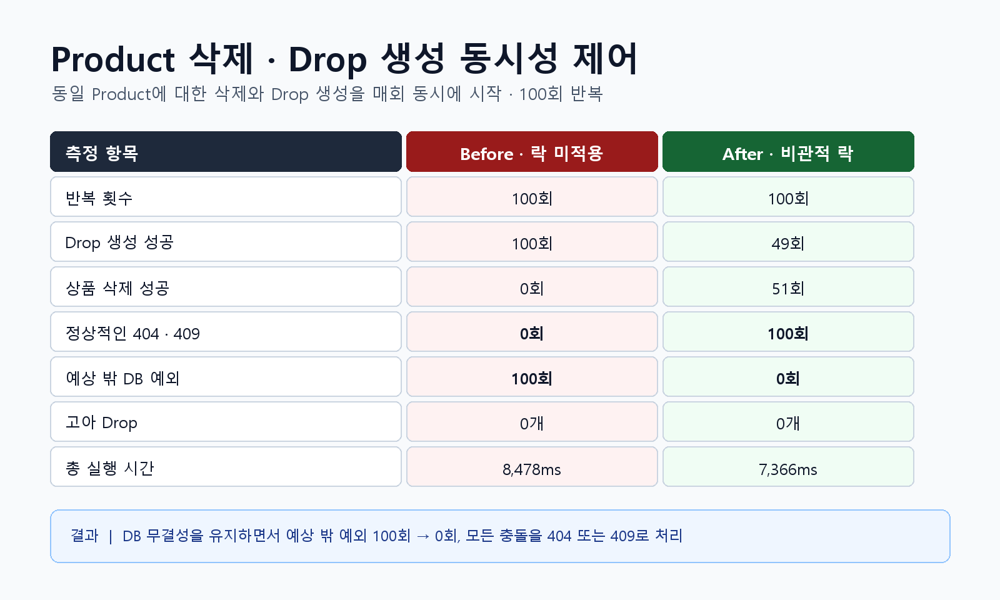

# Product 삭제와 Drop 생성 동시성 제어

## 문제 상황

판매자가 상품을 삭제하는 순간 다른 요청에서 같은 상품의 Drop을 생성하면,
상품 삭제의 Drop 존재 확인과 실제 DELETE 사이에 Drop INSERT가 들어올 수 있다.

```text
상품 삭제 요청:  Product 조회 → Drop 존재 확인(false) → 상품 DELETE
Drop 생성 요청:                         └→ Drop INSERT
```

이 경우 DB 외래키가 데이터 무결성은 지키지만 상품 삭제 요청에는
의도한 `409 Conflict` 대신 `DataIntegrityViolationException`이 발생할 수 있다.

## 테스트 조건

| 항목 | 조건 |
|---|---|
| 대상 기능 | 동일 Product 삭제와 Drop 생성 |
| 동시 실행 수 | 매회 2개 요청 |
| 반복 횟수 | 100회 |
| 동시 실행 도구 | `ExecutorService`, `CountDownLatch` |
| 데이터베이스 | MySQL 8.4.11, InnoDB |
| 트랜잭션 격리 수준 | `REPEATABLE_READ` |

## Before / After 비교



| 측정 항목 | Before: 락 미적용 | After: 비관적 락 적용 |
|---|---:|---:|
| 반복 횟수 | 100회 | 100회 |
| Drop 생성 성공 | 100회 | 49회 |
| 상품 삭제 성공 | 0회 | 51회 |
| `404 PRODUCT_NOT_FOUND` | 0회 | 51회 |
| `409 PRODUCT_IN_USE_BY_DROP` | 0회 | 49회 |
| 예상 밖 DB 예외 | **100회** | **0회** |
| 고아 Drop | 0개 | 0개 |
| 총 실행 시간 | 8,478ms | 7,366ms |

## Before 분석

- 100회 모두 Drop 생성이 먼저 완료됐다.
- 상품 삭제는 100회 모두 외래키 제약으로 실패했다.
- DB가 고아 Drop은 방지했지만 도메인에서 정의한 `409 Conflict`로 처리하지 못했다.
- 현재 문제는 데이터 손실보다 예상 가능한 경쟁 상황이 서버 오류로 노출되는 것이다.

## 개선 기준

- Product를 기준으로 상품 삭제와 Drop 생성이 동일한 잠금 순서를 사용한다.
- 먼저 처리된 요청에 따라 `404 Not Found` 또는 `409 Conflict`로 종료한다.
- `DataIntegrityViolationException`과 고아 Drop을 모두 0회로 만든다.
- 같은 조건으로 100회 재측정해 Before와 After를 비교한다.

## 적용 내용

- `ProductRepository.findByIdForUpdate`에 `PESSIMISTIC_WRITE` 잠금을 적용했다.
- Product 삭제와 Drop 생성이 모두 같은 Product 행을 잠근 뒤 작업하게 했다.
- 먼저 Product를 삭제하면 뒤의 Drop 생성은 `404 PRODUCT_NOT_FOUND`로 종료된다.
- 먼저 Drop을 생성하면 뒤의 Product 삭제는 `409 PRODUCT_IN_USE_BY_DROP`으로 종료된다.

## After 분석

- 100회 모두 두 요청 중 하나만 성공하고 나머지 하나는 정상적인 도메인 충돌로 종료됐다.
- 예상 밖 `DataIntegrityViolationException`이 100회에서 0회로 감소했다.
- Before와 After 모두 고아 Drop은 0개로 DB 무결성을 유지했다.
- 총 실행 시간은 실행 환경에 따라 달라질 수 있으므로 성능 향상 근거가 아니라 정확성 검증 참고값으로만 사용한다.
