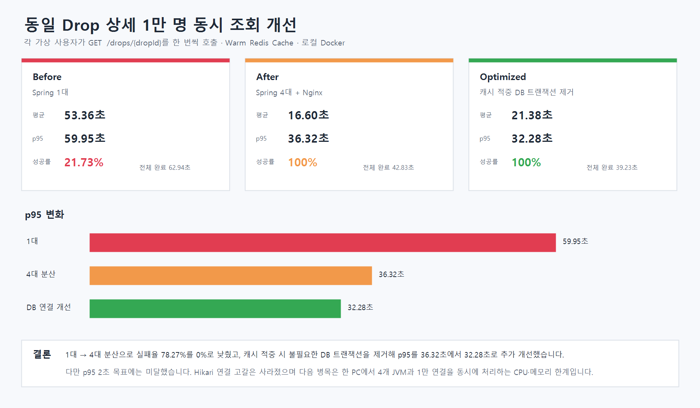
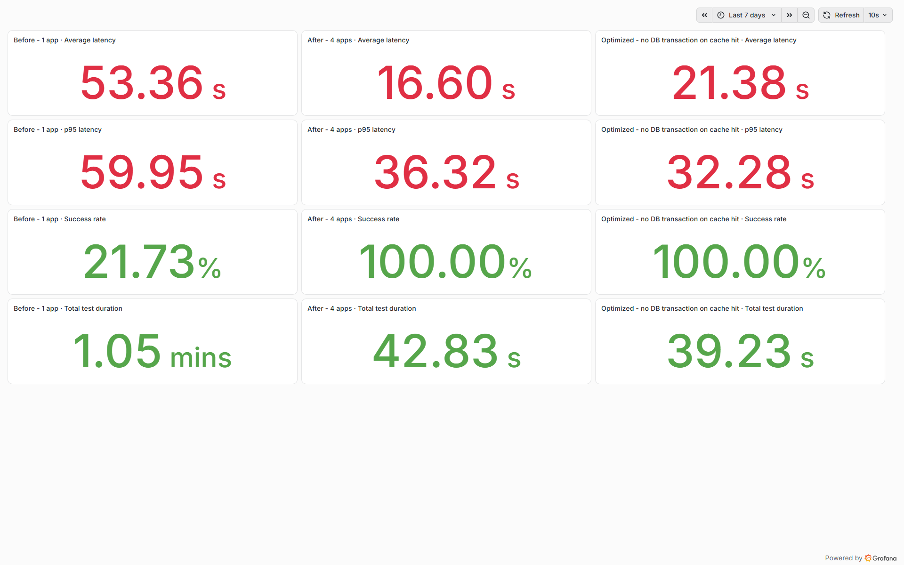

# Drop 상세 1만 명 동시 조회 개선 결과

## 테스트 목적

한정판 판매 시작 시각에 사용자가 같은 상품 화면으로 동시에 들어오는 상황을 재현했다. 가상 사용자 10,000명이 `GET /drops/{dropId}`를 한 번씩 호출하고, 한 서버가 요청을 감당하지 못하는 상태부터 서버 분산과 DB 연결 개선까지 같은 조건으로 비교했다.

프론트 화면에서는 사용자가 한정판 상품의 가격, 남은 수량, 할인율, 판매 시간을 확인하려고 **같은 Drop 상세 페이지를 동시에 새로 여는 상황**이다.

## 고정한 조건

| 항목 | 조건 |
|---|---|
| 대상 API | `GET /drops/1261706` |
| 가상 사용자 | 10,000 VU |
| 사용자 행동 | 각 VU가 상세 조회 1회 실행 |
| 캐시 | Redis Warm Cache, TTL 3초 |
| 애플리케이션 | Java 21, Spring Boot, 가상 스레드 |
| 서버 자원 | 컨테이너당 메모리 768MB, JVM Heap 512MB |
| 실행 환경 | 로컬 Windows Docker, CPU 12개, Docker 메모리 약 7.7GB |
| 계정 | JWT 한 개를 10,000 VU가 공유 |

## 단계별 구조

```text
Before
k6 10,000명 → Spring 1대 → Redis → MySQL

After
k6 10,000명 → Nginx → Spring 4대 → Redis → MySQL

Optimized
k6 10,000명 → Nginx → Spring 4대
                         ├─ 캐시 적중: Redis 응답 후 종료
                         └─ 캐시 미스: 짧은 Repository 읽기 트랜잭션 → MySQL
```

## 측정 결과

| 지표 | Before: 1대 | After: 4대 분산 | Optimized: DB 연결 개선 |
|---|---:|---:|---:|
| 실행 요청 | 10,000건 | 10,000건 | 10,000건 |
| 성공률 | 21.73% | **100%** | **100%** |
| 실패율 | 78.27% | **0%** | **0%** |
| 평균 응답 시간 | 53.36초 | **16.60초** | 21.38초 |
| p95 응답 시간 | 59.95초 | 36.32초 | **32.28초** |
| 최대 응답 시간 | 59.96초 | 37.04초 | **35.06초** |
| 테스트 전체 완료 시간 | 62.94초 | 42.83초 | **39.23초** |
| Hikari 연결 타임아웃 | 발생 | 발생 | **0건** |





## 어떤 코드가 병목을 줄였는가

기존 `DropService.getOne()`에는 캐시와 읽기 전용 트랜잭션이 함께 선언되어 있었다.

```java
@Transactional(readOnly = true)
@Cacheable(cacheNames = RedisCacheConfig.DROP_DETAIL_CACHE, key = "#dropId", sync = true)
public DropResponse getOne(Long dropId) {
    // DB 조회 후 응답 생성
}
```

부하 로그에서 Hikari 연결 10개가 모두 사용되어 최대 36초 동안 연결을 기다리는 현상을 확인했다. Redis에 응답이 있어도 서비스 트랜잭션이 먼저 열리면서 DB 연결을 점유했기 때문이다.

서비스의 트랜잭션을 제거하고, 실제 DB 조회가 필요한 Repository 메서드로 읽기 전용 트랜잭션 범위를 줄였다.

```java
@Cacheable(cacheNames = RedisCacheConfig.DROP_DETAIL_CACHE, key = "#dropId", sync = true)
public DropResponse getOne(Long dropId) {
    // 캐시 적중 시 DB 트랜잭션 없이 바로 반환
}

@Transactional(readOnly = true)
Optional<Drop> findDetailById(Long dropId);
```

그 결과 캐시 적중 요청은 Hikari 연결을 사용하지 않고, 캐시 미스만 Repository 조회 중에 DB 연결을 사용한다. 최적화 후 네 서버의 Hikari 연결 타임아웃은 모두 0건이었다.

## 결과 해석

- 서버 1대에서는 10,000건 중 7,827건이 60초 타임아웃으로 실패했다.
- 4대 분산 후 모든 요청이 성공했고, Before 대비 p95가 약 39.4% 감소했다.
- DB 연결 범위를 줄인 뒤 p95는 36.32초에서 32.28초로 약 11.1%, 전체 완료 시간은 약 8.4% 추가 감소했다.
- 마지막 단계의 평균은 16.60초에서 21.38초로 증가했다. 단일 로컬 장비에서 k6, 4개 JVM, Nginx, Redis, MySQL, InfluxDB를 함께 실행한 측정 편차가 크므로 평균 개선으로 주장하지 않는다.
- 최종 p95 32.28초는 목표 2초에 미달한다. DB 연결 풀 고갈은 제거됐고 다음 병목은 한 장비의 CPU·메모리와 동시에 생성되는 10,000개 연결이다.

## 재현 방법

```powershell
# 4대 Spring 서버와 Nginx 시작
powershell.exe -NoProfile -ExecutionPolicy Bypass `
  -File .\performance\start-drop-detail-cluster.ps1

# 1만 명 동시 조회 실행
powershell.exe -NoProfile -ExecutionPolicy Bypass `
  -File .\performance\start-drop-detail-concurrent-test.ps1 `
  -Phase Optimized -DropId 1261706 -ConcurrentUsers 10000 `
  -CacheMode Warm `
  -TargetBaseUrl http://dropit-performance-gateway:8080

# JSON 최종 통계를 Grafana 비교용 InfluxDB 측정값으로 발행
powershell.exe -NoProfile -ExecutionPolicy Bypass `
  -File .\performance\publish-drop-detail-concurrent-summary.ps1
```

Grafana 주소는 `http://localhost:3000/d/drop-detail-10k-concurrent/drop-detail-10k-concurrent-comparison`이다.

## 측정 한계와 다음 실험

- 한 번의 로컬 측정이므로 운영 환경 처리량으로 해석하지 않는다.
- 10,000 VU가 같은 JWT를 사용했다. 10,000개 실제 계정의 서로 다른 JWT 검증 비용은 별도 실험이 필요하다.
- 1만 동시 사용자는 누적 조회 1억 건과 다른 지표다. 1억 건은 장시간 지속 부하와 비용을 확인하는 Soak Test로 분리해야 한다.
- 다음 단계는 별도 부하 발생기와 여러 서버 장비를 사용하는 분산 k6, 애플리케이션 CPU·GC·Hikari 활성 연결 모니터링, 목표 RPS 기준 용량 산정이다.

## 검증

- Drop 관련 테스트 61개 통과
- 실패 0개, 오류 0개
- 세 단계 모두 k6 iteration 10,000건 완료
- Optimized 단계 HTTP 실패율 0%, 응답 검증 성공률 100%
