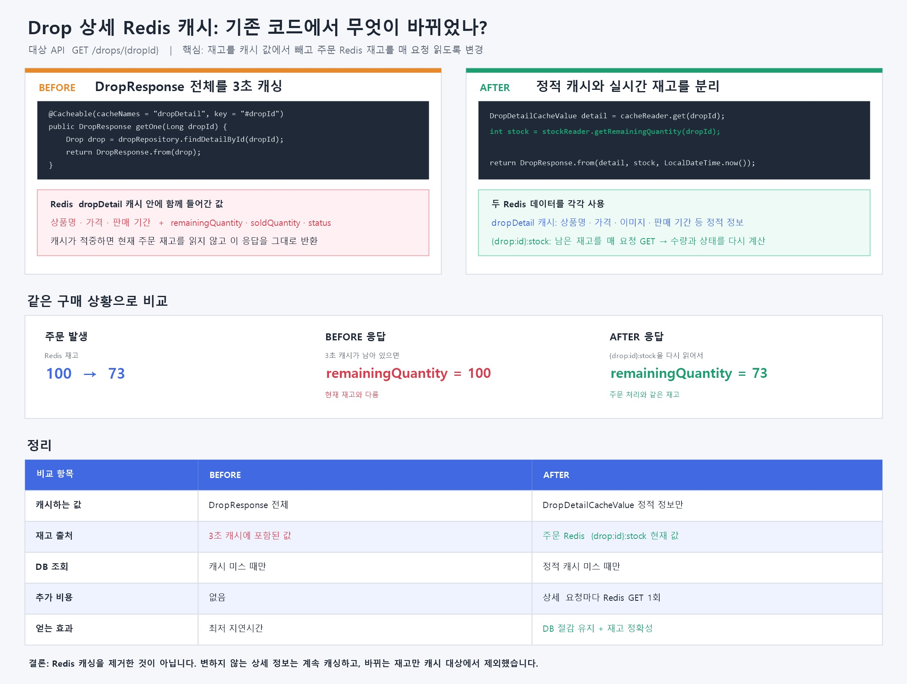

# Drop 상세 캐시 정확성 개선 및 부하 검증

## 문제

판매 시작 시 사용자가 호출하는 API는 다음과 같다.

```http
GET /drops/{dropId}
```

기존에는 `DropResponse` 전체를 Redis에 3초 동안 저장했다. 상품명·가격·판매 기간뿐 아니라 계속 바뀌는 `remainingQuantity`, `soldQuantity`, `status`도 함께 캐싱되어 구매 직후 최대 3초 동안 이전 재고가 보일 수 있었다.

## Before / After 구조

| 구분 | Before: 전체 응답 캐시 | After: 정적 캐시 + 실시간 재고 |
|---|---|---|
| 캐시 데이터 | 상품·가격·기간·재고·상태 | 상품·가격·기간 등 정적 정보 |
| 남은 재고 | 최대 3초 전 캐시 값 | 주문과 같은 Redis 재고 키를 매 요청 조회 |
| 판매 수량 | 캐시된 값 | `initialQuantity - currentStock` |
| 판매 상태 | 캐시된 값 | 현재 시각과 현재 재고로 계산 |
| DB 접근 | 캐시 미스에만 발생 | 캐시 미스에만 발생 |
| 추가 비용 | 없음 | 상세 요청마다 Redis GET 1회 |
| 핵심 효과 | 매우 빠른 조회 | DB 절감 효과를 유지하면서 재고 정확성 확보 |



## 요청 처리 흐름

```text
사용자 → GET /drops/{dropId}
       → DropDetailCacheReader
          ├─ 캐시 적중: 정적 정보 반환
          └─ 캐시 미스: DB 조회 → 정적 정보 캐시
       → DropStockReader
          └─ {drop:<id>}:stock 현재 값 조회
       → DropResponse
          └─ 정적 정보 + 현재 재고 + 현재 상태 결합
```

핵심 코드는 다음처럼 역할을 나눴다.

```java
public DropResponse getOne(Long dropId) {
    DropDetailCacheValue detail = dropDetailCacheReader.get(dropId);
    int remainingQuantity = dropStockReader.getRemainingQuantity(dropId);

    return DropResponse.from(detail, remainingQuantity, LocalDateTime.now());
}
```

- `DropDetailCacheReader`: 변하지 않는 상세 정보만 캐싱한다.
- `DropStockReader`: 주문 처리에서 사용하는 Redis 재고 키를 읽는다.
- `DropResponse.from(...)`: 현재 재고로 판매 수량과 상태를 계산한다.
- Redis 재고 키가 없거나 잘못된 경우 임의로 DB 값을 쓰지 않고 `503 DROP_STOCK_NOT_READY`를 반환한다. 준비되지 않은 재고로 주문 화면을 잘못 노출하지 않기 위한 fail-closed 정책이다.

## 현재 구조 부하 검증

### 판매 시작 스파이크

평상시 100 RPS에서 1초 안에 1,000 RPS로 증가시켜 1분 동안 유지했다.

| 지표 | LiveStock 결과 | 목표 | 판정 |
|---|---:|---:|---|
| 완료 HTTP 요청 | 69,379건 | - | - |
| 평균 처리량 | 654.53 RPS | - | - |
| 평균 응답 시간 | 105.48ms | - | - |
| p95 응답 시간 | 328.65ms | 2,000ms 미만 | 통과 |
| p99 응답 시간 | 600.59ms | - | - |
| HTTP 실패율 | 0% | 1% 미만 | 통과 |
| 시작하지 못한 요청 | 1,670건 | 0건 | 추가 개선 필요 |
| 최대 활성 VU | 428명 | 최대 2,000명 | - |

응답 목표는 충족했지만 정해진 도착률에 맞춰 시작하지 못한 요청이 남았다. 따라서 로컬 환경에서 1,000 RPS를 완전히 수용했다고 표현하지 않는다.

### 10,000명 동시 조회

가상 사용자 10,000명이 같은 Drop 상세 API를 한 번씩 동시에 호출했다.

| 지표 | LiveStock 결과 |
|---|---:|
| 완료 요청 | 10,000건 |
| 성공률 | 100% |
| 실패율 | 0% |
| 평균 응답 시간 | 523.96ms |
| p95 응답 시간 | 1,184.50ms |
| 최대 응답 시간 | 2,512.91ms |
| 전체 완료 시간 | 9.66초 |
| 애플리케이션 오류·Hikari timeout | 0건 |

테스트 종료 후 Redis 재고가 100으로 유지됨을 확인했다. 상세 조회는 재고를 읽기만 하므로 조회 부하가 재고를 차감하지 않는 것도 함께 검증했다.

## 기존 수치와 비교할 때의 주의점

| 시나리오 | 기존 전체 응답 캐시 | 현재 실시간 재고 결합 |
|---|---:|---:|
| 1,000 RPS 스파이크 p95 | 20.12ms | 328.65ms |
| 1,000 RPS 스파이크 실패율 | 0% | 0% |
| 10,000명 동시 조회 p95 | 32.28초 | 1.18초 |
| 10,000명 동시 조회 성공률 | 100% | 100% |

기존 전체 응답 캐시는 Redis 응답 한 번만 사용하므로 스파이크 지연이 더 낮다. 현재 구조는 재고 정확성을 얻는 대신 Redis GET 한 번이 추가됐다.

반대로 10,000명 결과가 크게 좋아졌지만, 기존 측정은 단일 Spring 단계부터 이어진 과거 환경이고 현재 측정은 Nginx와 Spring 4대 및 이후 병합된 설정을 포함한다. 따라서 32.28초에서 1.18초로 줄어든 전체 차이를 캐시 분리 코드 하나의 효과라고 주장하지 않는다. 이번 변경의 직접적인 효과는 **재고 정확성 확보**이며, 현재 구조가 목표 부하에서 동작하는지를 별도로 검증한 결과다.

## 테스트 검증

- 같은 Drop을 두 번 조회할 때 정적 메타데이터 DB 조회 1회
- 두 조회 사이 Redis 재고 변경 시 두 번째 응답에 즉시 반영
- 현재 재고로 `soldQuantity`, `READY`, `OPEN`, `SOLDOUT`, `CLOSED` 계산
- 수정·공개 여부 변경·삭제 시 정적 상세 캐시 제거
- Redis 재고 누락·음수·잘못된 문자열·연결 장애 시 503 처리
- Drop 테스트 총 66개 통과(실패 0개, 오류 0개)

## 재현

```powershell
# 판매 시작 스파이크
powershell.exe -NoProfile -ExecutionPolicy Bypass `
  -File .\performance\start-drop-detail-spike-test.ps1 `
  -Phase LiveStock -DropId 1262071 `
  -NormalRps 100 -SpikeRps 1000 `
  -PreAllocatedVUs 200 -MaxVUs 2000 -StockQuantity 100

# 10,000명 동시 조회
powershell.exe -NoProfile -ExecutionPolicy Bypass `
  -File .\performance\start-drop-detail-concurrent-test.ps1 `
  -Phase LiveStock -DropId 1261706 -ConcurrentUsers 10000 `
  -CacheMode Warm -StockQuantity 100 `
  -TargetBaseUrl http://dropit-performance-gateway:8080

# 정확한 k6 JSON 통계를 Grafana용 InfluxDB에 발행
powershell.exe -NoProfile -ExecutionPolicy Bypass `
  -File .\performance\publish-drop-detail-spike-summary.ps1

powershell.exe -NoProfile -ExecutionPolicy Bypass `
  -File .\performance\publish-drop-detail-concurrent-summary.ps1
```

Grafana 대시보드 UID는 `drop-detail-live-stock`이다. 원본 k6 JSON은 `performance/results/raw`에 로컬로만 보관하며 Git에는 포함하지 않는다.

## 다음 개선

1. 동일 테스트를 3회 이상 반복해 중앙값으로 비교한다.
2. Spring CPU·GC, Redis latency, 연결 수를 함께 수집해 시작하지 못한 1,670건의 병목을 찾는다.
3. 운영에서는 판매 시작 전에 정적 캐시와 재고 키를 미리 준비하고, Redis 장애 시 상세 조회의 실패 정책을 알림과 연결한다.
