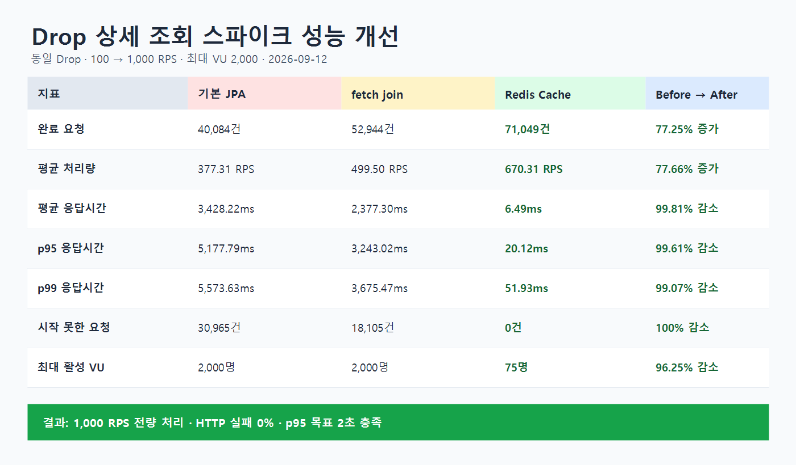
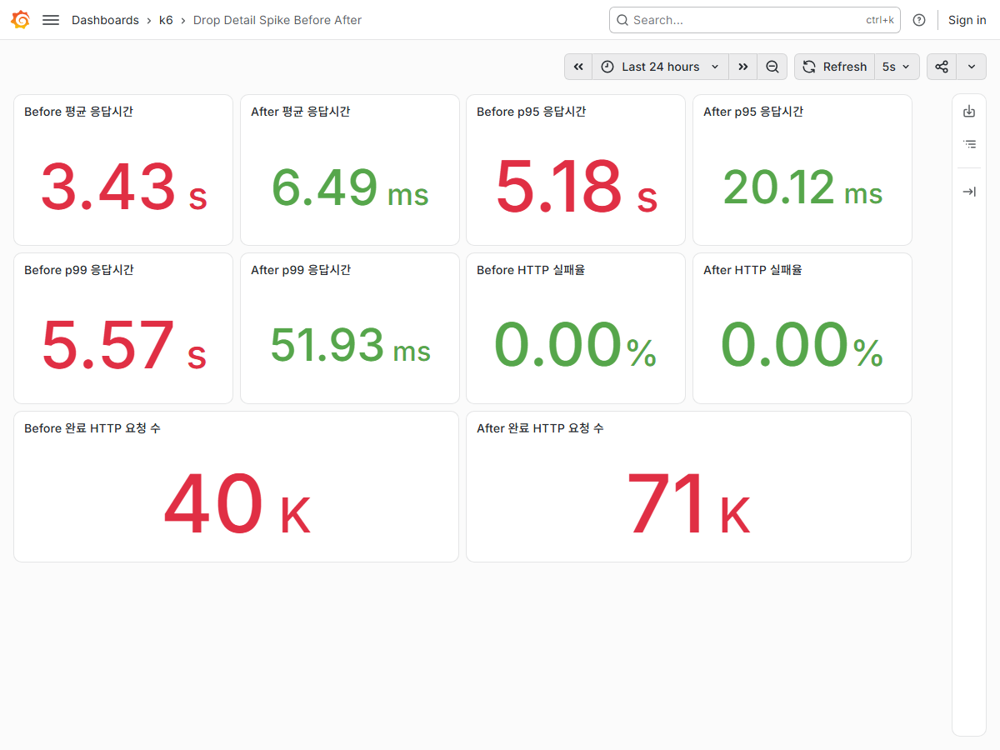

# Drop 상세 조회 판매 시작 스파이크 테스트

## 테스트 목적

판매 시작 시각에 사용자가 같은 한정판 상품의 Drop 상세 페이지로 몰리는 상황을 재현했다.
프론트 화면으로 보면 사용자가 판매 페이지를 새로고침하거나 상세 정보를 확인하는 요청이다.

```http
GET /drops/{dropId}
```

목표는 1초 안에 100 RPS에서 1,000 RPS로 증가해도 p95 응답시간 2초 미만과 HTTP 실패율 1% 미만을 유지하는 것이다.

## 테스트 조건

| 항목 | 값 |
|---|---:|
| 측정일 | 2026-09-12 |
| 대상 Drop ID | 1,262,071 |
| 평상시 부하 | 100 RPS, 30초 |
| 판매 시작 스파이크 | 1초 안에 1,000 RPS |
| 스파이크 유지 | 1분 |
| 감소 구간 | 15초 |
| 최대 VU | 2,000 |
| 실행 환경 | Windows 로컬 Spring 서버, Docker k6·InfluxDB·Grafana·MySQL·Redis |

각 단계는 같은 Drop ID, 부하 단계, JWT 인증, 실행 시간과 최대 VU로 1회씩 측정했다.

## Before / After 결과

| 지표 | 기본 JPA | fetch join | Redis Cache | Before → After |
|---|---:|---:|---:|---:|
| 완료 HTTP 요청 | 40,084건 | 52,944건 | 71,049건 | 77.25% 증가 |
| 실제 평균 처리량 | 377.31 RPS | 499.50 RPS | 670.31 RPS | 77.66% 증가 |
| 평균 응답시간 | 3,428.22ms | 2,377.30ms | 6.49ms | 99.81% 감소 |
| p95 응답시간 | 5,177.79ms | 3,243.02ms | 20.12ms | 99.61% 감소 |
| p99 응답시간 | 5,573.63ms | 3,675.47ms | 51.93ms | 99.07% 감소 |
| 최대 응답시간 | 6,934.71ms | 4,560.20ms | 381.40ms | 94.50% 감소 |
| HTTP 실패율 | 0% | 0% | 0% | 동일 |
| 시작하지 못한 요청 | 30,965건 | 18,105건 | 0건 | 100% 감소 |
| 최대 활성 VU | 2,000명 | 2,000명 | 75명 | 96.25% 감소 |



## 단계별 코드 변화

### 1. 기본 JPA 조회

```java
dropRepository.findById(dropId)
```

요청마다 DB에서 Drop을 조회했다. 응답을 만들면서 Product와 Seller도 사용하므로 연관 데이터 조회 비용까지 반복됐다.

### 2. fetch join 적용

```java
@Query("""
    select d
    from Drop d
    join fetch d.product p
    join fetch p.seller
    where d.id = :dropId
    """)
Optional<Drop> findDetailById(@Param("dropId") Long dropId);
```

Drop·Product·Seller를 한 SQL로 가져와 DB 왕복을 줄였다. 그 결과 p95는 5.18초에서 3.24초로 줄었지만, 같은 데이터를 요청마다 DB에서 읽는 구조는 남았다.

### 3. Redis Cache 적용

```java
@Cacheable(cacheNames = RedisCacheConfig.DROP_DETAIL_CACHE,
        key = "#dropId", sync = true)
public DropResponse getOne(Long dropId) {
    // 캐시가 없을 때만 DB 조회
}
```

첫 요청의 `DropResponse`를 Redis에 저장하고 같은 Drop ID 요청은 3초 동안 저장된 응답을 재사용한다. `sync = true`는 한 애플리케이션 인스턴스에서 캐시가 비었을 때 여러 요청이 동시에 DB로 몰리는 현상을 줄인다.

수정·공개 여부 변경·삭제 시에는 다음 설정으로 해당 Drop 캐시를 제거한다.

```java
@CacheEvict(cacheNames = RedisCacheConfig.DROP_DETAIL_CACHE, key = "#dropId")
```

## 캐시 정책

| 정책 | 선택 | 이유 |
|---|---|---|
| 캐시 대상 | Drop 상세 응답 | 판매 시작 시 같은 Drop에 조회가 집중됨 |
| TTL | 3초 | 상태와 남은 재고가 오래된 값으로 보이는 시간을 제한 |
| 캐시 키 | Drop ID | 상세 API의 조회 단위와 일치 |
| 무효화 | 수정·공개 변경·삭제 시 즉시 제거 | 변경 전 응답이 남는 문제 방지 |
| 재고 정확성 | 구매 시 DB에서 다시 검증 | 조회 캐시는 화면 표시용이며 주문 성공 여부를 결정하지 않음 |

실제 확인 결과 상세 조회 직후 `dropit::dropDetail::1262071` 키가 생성됐고 약 3초 TTL이 적용됐다. 통합 테스트에서는 같은 Drop을 두 번 조회해 Repository가 한 번만 호출되는 것과 공개 여부 변경 후 캐시가 제거되는 것을 검증했다.

## Grafana 측정 화면



## 결론

- 기본 JPA 단계는 1,000 RPS를 만들기 위해 최대 VU 2,000명을 모두 사용했지만 30,965건을 시작하지 못했다.
- fetch join은 연관 조회 비용을 줄였으나 p95 3.24초와 누락 요청 18,105건이 남았다.
- Redis Cache 적용 후 목표 요청 71,049건을 모두 처리했고 시작하지 못한 요청은 0건이었다.
- p95는 20.12ms로 목표 2초를 충족했고 HTTP 실패율은 0%였다.

## 한계와 다음 검증

- 로컬 단일 서버에서 각 단계를 1회 측정한 결과이므로 운영 용량으로 일반화할 수 없다.
- `sync = true`는 단일 인스턴스 안에서만 동시 캐시 생성을 막는다. 다중 서버 환경에서는 분산 락이나 사전 캐시 적재를 별도로 검토해야 한다.
- 3초 동안 상태와 표시용 남은 재고가 실제 값보다 늦게 보일 수 있다. 구매 처리는 반드시 DB 또는 원자적 재고 저장소를 기준으로 판단해야 한다.
- 다음 단계에서는 테스트를 여러 번 반복해 중앙값을 비교하고, Spring·JVM·DB·Redis 지표를 함께 수집해 병목 이동을 확인한다.

원본 k6 JSON은 `performance/results/raw`에 로컬로만 보관하며 Git에는 포함하지 않는다.
