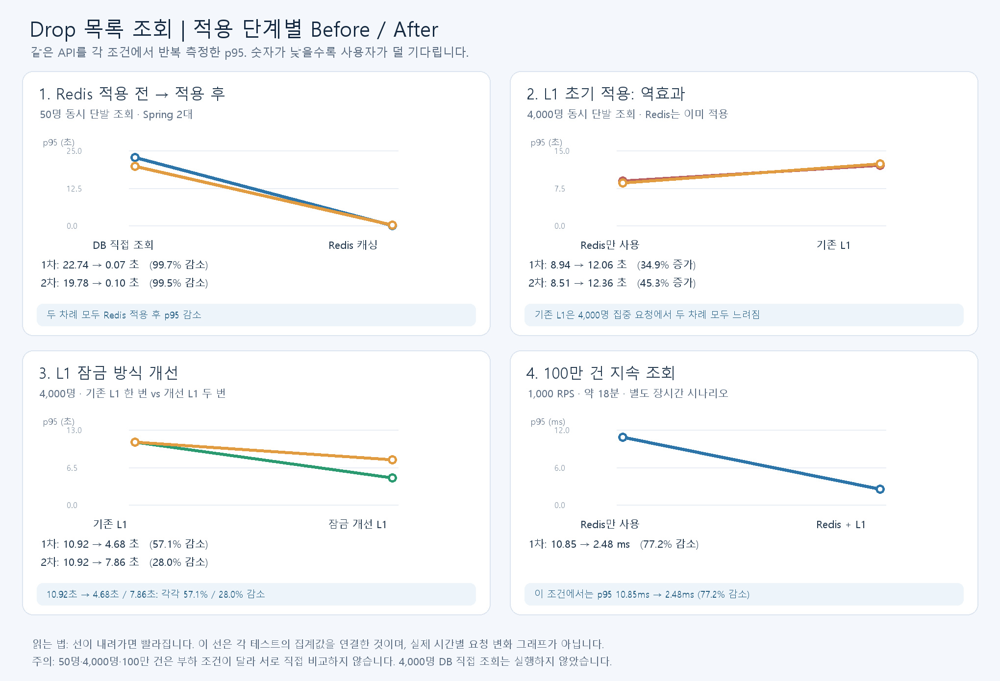

# 판매 시작 Drop 목록: 4,000명 동시 단발 조회

- API: `GET /drops?sortType=LATEST&page=0&size=20`
- 조건: 같은 JAR·데이터·Nginx·Spring 서버 2대, k6 `per-vu-iterations`로 4,000명 × 각 1회. 부하 발생기는 Docker 메모리 2GB·CPU 2개로 제한했고 InfluxDB 실시간 출력은 끄고 원본 요약 JSON을 저장했다.
- 실행 순서: Redis → Redis+L1 → Redis+L1 재측정 → Redis 재측정. 서버는 단계 변경 시 재시작했다.

| 캐시 단계 | 1차 p95 | 1차 HTTP 200 | 2차 p95 | 2차 HTTP 200 | Redis만 사용 대비 |
| --- | ---: | ---: | ---: | ---: | --- |
| Redis 적용 전(DB 직접 조회) | **미실행** | **미실행** | **미실행** | **미실행** | 같은 부하의 개선율 계산 불가 |
| Redis 적용 후 | 8.94초 | 4,000/4,000 | 8.51초 | 4,000/4,000 | 기준 |
| Redis + 초기 서버별 L1 200ms | 12.06초 | 4,000/4,000 | 12.36초 | 4,000/4,000 | **1차 34.91%, 2차 45.27% 악화** |

초기 L1의 갱신 잠금을 `synchronized`에서 `ReentrantLock`으로 변경한 뒤 별도 4,000명 측정에서는 기존 L1 JAR의 p95 10.92초 대비 **4.68초·7.86초**를 기록했다. 각각 **57.1%·28.0% 감소**했으며 모든 요청이 정상 응답했다. 실행 시점이 다른 Redis 단독 측정과 직접 개선율을 계산하지 않는다.

## 이미지: 적용 단계별 측정 결과

이미지는 저장된 k6 원본 요약값으로 만든 단계별 비교다. 연결선은 시간별 요청 추이가 아니라 각 실행의 집계값을 연결한 것이다. 50명·4,000명·100만 건은 서로 다른 시나리오로 분리했다.

Redis 적용 전 DB 직접 조회는 앞선 **50명** 실험만으로 p95가 22.74초·19.78초였다. 4,000명을 로컬 PC에 강제로 넣으면 결과 저장 전에 측정 서버와 DB가 포화될 수 있어 실행하지 않았다. **50명 DB 결과와 4,000명 Redis 결과를 같은 부하의 Before/After 개선율로 계산하지 않는다.**

초기 4,000명 단발 조회에서 L1은 이득이 없었다. Java 21 가상 스레드 환경에서 200ms TTL 갱신의 `synchronized` 구간이 병목 후보였고, 최종 구현은 단일 갱신을 유지하면서 잠금을 `ReentrantLock`으로 교체했다. 다만 실제 pin 이벤트와 락 대기 시간을 직접 계측하지 않았으므로 원인을 단정하지 않는다. 다른 1,000 RPS 지속 조회의 개선 결과도 판매 시작 단발 시나리오에 일반화하지 않는다.

Grafana 그래프는 저장된 k6 요약값을 로컬 InfluxDB로 가져온 **단계별 집계**다. 요청별 실시간 시계열은 아니다. 각 단계는 로컬 2회 측정이며 운영 수용량을 보장하지 않는다.
