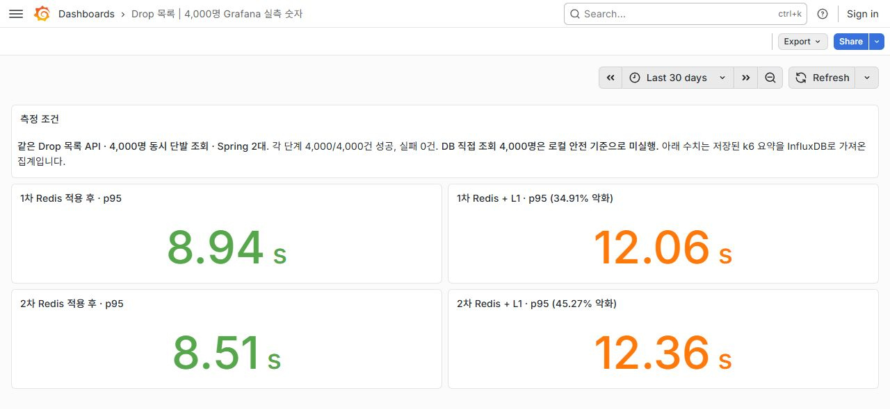

# 판매 시작 Drop 목록: 4,000명 동시 단발 조회

- API: `GET /drops?sortType=LATEST&page=0&size=20`
- 조건: 같은 JAR·데이터·Nginx·Spring 서버 2대, k6 `per-vu-iterations`로 4,000명 × 각 1회. 부하 발생기는 Docker 메모리 2GB·CPU 2개로 제한했고 InfluxDB 실시간 출력은 끄고 원본 요약 JSON을 저장했다.
- 실행 순서: Redis → Redis+L1 → Redis+L1 재측정 → Redis 재측정. 서버는 단계 변경 시 재시작했다.

| 캐시 단계 | 1차 p95 | 1차 HTTP 200 | 2차 p95 | 2차 HTTP 200 | Redis만 사용 대비 |
| --- | ---: | ---: | ---: | ---: | --- |
| Redis 적용 전(DB 직접 조회) | **미실행** | **미실행** | **미실행** | **미실행** | 같은 부하의 개선율 계산 불가 |
| Redis 적용 후 | 8.94초 | 4,000/4,000 | 8.51초 | 4,000/4,000 | 기준 |
| Redis + 서버별 L1 200ms | 12.06초 | 4,000/4,000 | 12.36초 | 4,000/4,000 | **1차 34.91%, 2차 45.27% 악화** |

## 이미지: 실제 Grafana 측정 화면

Grafana 화면은 저장된 k6 원본 요약값을 InfluxDB로 가져와 표시한 결과다. 50명·4,000명·100만 건은 서로 다른 시나리오로 분리했다.

Redis 적용 전 DB 직접 조회는 앞선 **50명** 실험만으로 p95가 22.74초·19.78초였다. 4,000명을 로컬 PC에 강제로 넣으면 결과 저장 전에 측정 서버와 DB가 포화될 수 있어 실행하지 않았다. **50명 DB 결과와 4,000명 Redis 결과를 같은 부하의 Before/After 개선율로 계산하지 않는다.**

이번 4,000명 단발 조회에서 L1은 이득이 없었다. 현재 L1 구현은 200ms TTL이 만료될 때 `synchronized` 구간에서 Redis 목록을 다시 읽는다. 만료 시 동시 요청 대기가 병목인지 아직 확인되지 않았으므로, 다음 실험에서는 L1 hit/load와 락 대기 시간을 함께 측정해야 한다. 다른 1,000 RPS 지속 조회에서 L1이 개선된 결과를 이 판매 시작 단발 시나리오에 일반화하지 않는다.

Grafana 그래프는 저장된 k6 요약값을 로컬 InfluxDB로 가져온 **단계별 집계**다. 요청별 실시간 시계열은 아니다. 각 단계는 로컬 2회 측정이며 운영 수용량을 보장하지 않는다.
