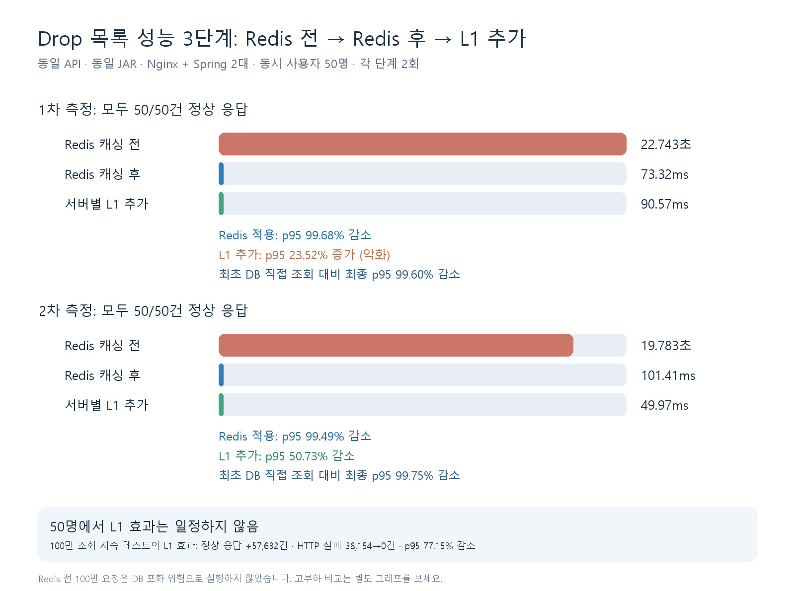
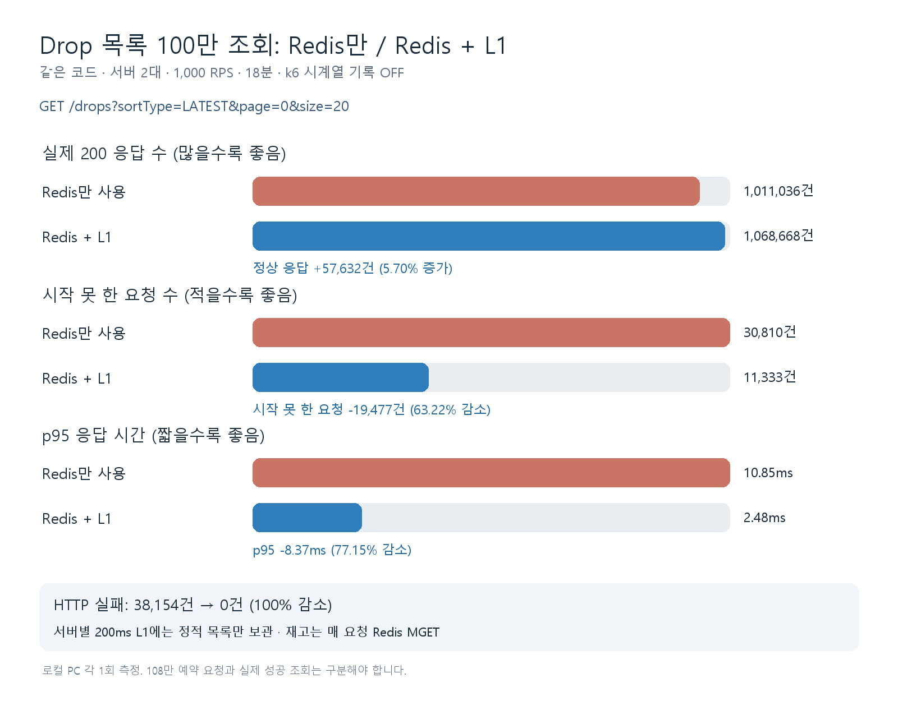

# Drop 목록 조회 성능: Redis 전 → Redis 후 → L1 추가

대상 API: `GET /drops?sortType=LATEST&page=0&size=20`. 동일 JAR·데이터·Nginx·Spring 서버 2대를 사용했다. Redis 전에는 QueryDSL/MySQL에서 목록 응답을 직접 생성한다. Redis 후에는 정적 목록을 Redis에서 가져오고 재고를 매 요청 Redis MGET으로 읽는다. L1 단계는 서버별로 **정적 목록만 200ms** 보관한다.

## 같은 부하 비교: 동시 가상 사용자 50명

| 단계 | 1차 p95 | 이전 단계 대비 | 2차 p95 | 이전 단계 대비 |
| --- | ---: | ---: | ---: | ---: |
| Redis 캐싱 전 | 22.743초 | 기준 | 19.783초 | 기준 |
| Redis 캐싱 후 | 73.32ms | **99.68% 감소** | 101.41ms | **99.49% 감소** |
| Redis + 서버별 L1 | 90.57ms | **23.52% 증가(악화)** | 49.97ms | **50.73% 감소** |

모든 측정이 50/50건 정상 응답이었다. 처음 DB 직접 조회 대비 최종 L1 p95는 1차 **99.60%**, 2차 **99.75%** 감소했다. 하지만 50명 단발 조회의 Redis→L1 효과는 두 번의 방향이 달라 **항상 개선된다고 주장할 수 없다.** 감소율은 `(이전 p95 − 이후 p95) ÷ 이전 p95 × 100`으로 계산했다.

## 지속 조회: Redis 캐싱 후 → L1 추가

두 단계 모두 1,000 RPS·18분·같은 서버 2대 조건이다. Redis 전 DB 직접 조회는 50명에서도 p95가 약 20초이고 Nginx 응답 제한 30초에 가까워 **100만 요청을 로컬 PC에 강제로 넣지 않았다.** 따라서 이 표는 Redis 전까지 포함한 3단계 동일 부하 비교가 아니다.

| 지표 | Redis 캐싱 후 | L1 추가 후 | 실제 변화 |
| --- | ---: | ---: | ---: |
| HTTP 200 정상 조회 | 1,011,036건 | 1,068,668건 | **+57,632건, 5.70% 증가** |
| HTTP 실패 | 38,154건 | 0건 | **−38,154건, 100% 감소** |
| 시작하지 못한 요청 | 30,810건 | 11,333건 | **−19,477건, 63.22% 감소** |
| p95 응답 시간 | 10.85ms | 2.48ms | **−8.37ms, 77.15% 감소** |

위 이미지는 Grafana 그래프 4개를 캡처해 한 장에 배치한 것이다. 저장된 k6 요약을 로컬 InfluxDB로 가져와 표시했으며, 실시간 요청 추이를 나타내지 않는다.

Redis 캐싱 후에는 판매 시작 순간 동시 가상 사용자 **2,000명 조회 2,000/2,000건 성공**도 별도로 확인했다. 2,000명 동시 조회와 100만 누적 성공 조회는 **서로 다른 시나리오**다. 장시간 결과는 조건별 로컬 PC 1회 측정이며 운영 수용량은 별도로 검증해야 한다.
