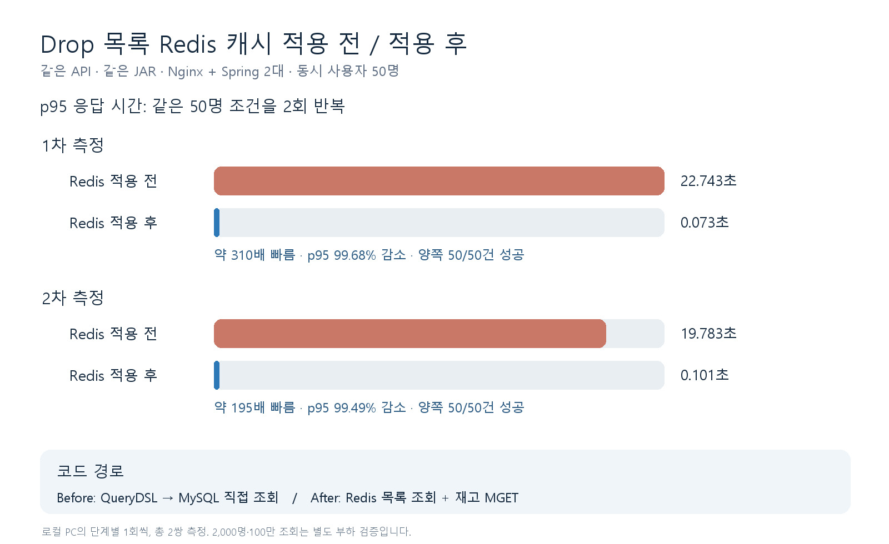
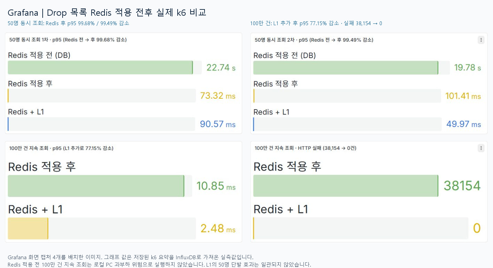

# Drop 목록 Redis 캐시 적용 전후

- 대상 API: `GET /drops?sortType=LATEST&page=0&size=20`
- 조건: 같은 JAR·데이터·Nginx·Spring 서버 2대, L1 미사용, 동시 사용자 50명이 각 1회 조회

| 지표 | Redis 적용 전 | Redis 적용 후 | 변화 |
| --- | ---: | ---: | ---: |
| 1차 p95 | 22.743초 | 73.32ms | 99.68% 감소 |
| 2차 p95 | 19.783초 | 101.41ms | 99.49% 감소 |
| 정상 응답 | 50/50건 | 50/50건 | 동일 |

두 단계 모두 정상 응답 수가 같으므로 이 비교에서 확인한 효과는 조회 지연 감소다. 로컬 PC에서 수행한 결과이며 운영 수용량을 보장하지 않는다.
