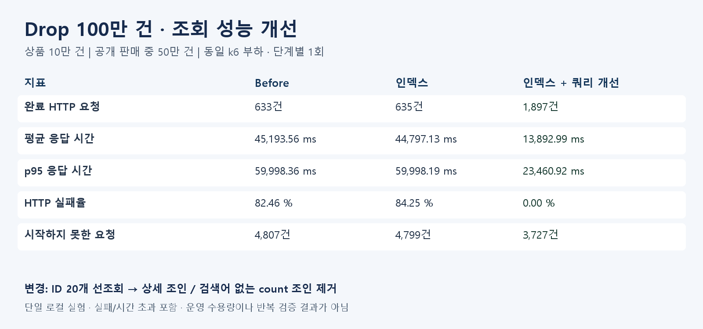

# Drop 100만 건 조회 성능 개선

## 🛠️ 주요 변경 사항

- 판매 중 Drop 첫 페이지를 마감 임박순으로 조회할 때 대량 조인·정렬이 발생하는 문제를 개선했습니다.
- 복합 인덱스를 적용한 뒤 효과를 확인하고, ID 선조회 및 조건부 count 조인 제거를 추가했습니다.
- 기존 Page 응답, 전체 개수, 검색·정렬 계약을 유지합니다.

## ✨ Before / After

| 지표 | Before | 인덱스 | 인덱스 + 쿼리 개선 |
|---|---:|---:|---:|
| 완료 HTTP 요청 | 633건 | 635건 | 1,897건 |
| 평균 응답 시간 | 45,193.56 ms | 44,797.13 ms | 13,892.99 ms |
| p95 응답 시간 | 59,998.36 ms | 59,998.19 ms | 23,460.92 ms |
| HTTP 실패율 | 82.46 % | 84.25 % | 0.00 % |
| 시작하지 못한 요청 | 4,807건 | 4,799건 | 3,727건 |



HTTP 완료 수에는 오류 응답·시간 초과도 포함됩니다. 시작하지 못한 요청은 k6의 dropped_iterations이며 서버가 거절한 요청 수와 다릅니다. p95는 실패 요청을 포함하며 Before의 약 60초는 클라이언트 시간 초과의 영향을 받습니다.

## 실험 조건

- API: `GET /drops?status=OPEN&sortType=CLOSING_SOON&page=0&size=20`
- 상품 100,000건, Drop 1,000,000건, 공개 판매 중 500,000건. 판매자는 한 명인 집중 시나리오이며 실제 운영 규모라는 가정은 아닙니다.
- Docker MySQL 8.4, Spring 서버, Docker k6·InfluxDB·Grafana를 같은 Windows PC에서 실행했습니다.
- 75초 동안 10→20→50→100→200→0 RPS, 최대 500 VU, 종료 대기 30초. 단계별 1회 측정했습니다.
- 모든 단계에서 서버를 같은 설정으로 실행하고 API 사전 호출 후 측정했습니다. DB 버퍼 캐시는 초기화하지 않았습니다.
- 요청량·데이터·페이지 크기·인증·연결 풀 설정은 동일합니다. 인덱스 단계에서는 통계를 갱신했습니다.

## 원인과 변경 코드

기존에는 상품·판매자를 조인한 결과에서 조건에 맞는 50만 건을 정렬했습니다. 인덱스를 추가해도 진단 실행 계획은 기존 외래키 조회를 선택했습니다.

```java
// Before: 조인한 전체 후보를 정렬하고 페이지 조회
selectFrom(drop).join(drop.product, product).fetchJoin()
    .join(product.seller, user).fetchJoin()
    .where(conditions).orderBy(order).offset(offset).limit(size);

// After: 필요한 ID만 선조회하고 그 ID에 한해 상세 조인
select(drop.id).from(drop).where(conditions)
    .orderBy(order).offset(offset).limit(size);
selectFrom(drop).join(drop.product, product).fetchJoin()
    .join(product.seller, user).fetchJoin()
    .where(drop.id.in(ids)).orderBy(order);
```

위 코드는 흐름을 설명하는 발췌이며 실제 구현은 `DropRepositoryCustomImpl`입니다. 키워드가 있으면 ID·count 쿼리에도 상품·판매자 조인을 유지합니다. 키워드가 없으면 필수 FK 관계를 전제로 count 조인을 생략합니다. 상세 조회에서 정렬을 다시 지정해 IN 조건으로 순서가 바뀌지 않게 했습니다.

인덱스: `(visible, close_at, id DESC, open_at, remaining_quantity, product_id)`.

## SQL 진단

| 단계 | 목록 또는 ID 쿼리 | count |
|---|---:|---:|
| Before | 2,683ms | 1,916ms |
| 인덱스 | 3,293ms | 2,362ms |
| 쿼리 개선 | ID 20개 3.26ms | 714ms |

진단용 SQL은 Drop 컬럼만 선택하므로 실제 API의 fetch join 전체 투영과 같지 않습니다. 최종 ID 쿼리 시간에는 후속 상세 쿼리가 포함되지 않습니다. 이 값들을 API 개선율로 환산하지 않았으며 API 비교는 위 k6 표를 사용합니다.

## ⚠️ 주의 사항 및 남은 한계

- 정확한 totalElements를 유지하므로 최종 count도 인덱스 후보 약 80만 건을 읽습니다. 인덱스만으로 목표 부하를 모두 처리한다고 주장하지 않습니다.
- 단일 실행이라 반복 편차·통계적 유의성을 확인하지 않았습니다. 키워드 검색, 뒷페이지, 여러 판매자 분포의 성능은 이번 측정 범위 밖입니다.
- ID 선조회로 쿼리는 2회에서 3회로 증가합니다. 기존 read-only 트랜잭션 및 MySQL REPEATABLE READ 안에서 페이지와 상세를 읽습니다.
- 재고 컬럼을 포함하는 인덱스는 재고 변경 시 유지 비용이 있습니다. 재고 쓰기 부하 영향은 별도 검증이 필요합니다.
- Before/인덱스 단계의 시간 초과에서 기존 k6 JSON 검증이 null body 예외를 냈습니다. HTTP 지표는 저장됐으며 checks를 정확성 근거로 사용하지 않았습니다.
- 다음 후보: 정확한 전체 개수가 불필요한 경우 별도 Slice API, 검색어별 실행 계획 개선. API 계약 변경은 팀 합의 후 진행합니다.

## 🧪 테스트 결과

- [x] Drop 테스트 43개 통과, 실패 0개, 오류 0개
- [x] MySQL 통합 테스트 2개 포함: 키워드 검색 페이징·빈 페이지·전체 개수와 기본 조회의 기존 조인 쿼리 결과 일치
- [x] k6 세 단계 측정 완료 (원본 JSON은 로컬 생성물로 Git 제외)
- [ ] 최종 p95 2초 목표 미달

## 💡 관련 이슈

- 이슈 번호 미확인. 실제 번호를 확인한 뒤 연결합니다.

